<p align="center"><em>Zoom all the way out and the app grid becomes a cosmic web — every square a frame waiting to be built.</em></p>

# CLONE FRAME · HUB

**A visual interface between you and your machine — a Unix with a face.**

[](LICENSE)
[](docs/INSTALL.md)
[](#)
[](#-bring-your-own-model)
[](#-the-single-file-build)
[](#-support-the-developer)

> [!CAUTION]
> **🔒 Security comes first.**
> CLONE FRAME HUB is in an active **Production & Development phase**. Because it gives
> real access to your **shell, files, network, and wallet**, we **strongly recommend
> running it inside a container / Docker** — isolate it in a sandbox you trust rather
> than directly on your primary machine.
>
> Keep the powerful permissions **off** until you need them, and review what your
> agents do. **You are the pilot** — the app hands you the controls, it does not fly
> itself.

---

## What is this?

CLONE FRAME HUB is a local, double-click desktop app. It is made of exactly **two
pieces**: one `index.html` that draws the entire interface, and one small local
daemon — the **HUB Bridge** — that does the real work on your machine. Nothing runs
in the cloud unless you point it there.

Think of it as **Unix with a face**. Under the hood your computer already has a
shell, a filesystem, processes, and network tools. CLONE FRAME gives all of that a
calm, visual surface: a real terminal, a file tree, an in-app browser, email, crews
of agents behind safety gates, and a **local AI cluster** that serves models from
your own hardware — each one a frame in a grid you can arrange and grow.

Crucially, **there is no embedded assistant**. You bring your own model. That can be
a cloud API key that never leaves your machine, or a fully local model served by the
built-in **MATRIX** cluster on your own devices. Your keys live in your session, your
files live in plain folders on your disk, and the app is built so that neither ever
leaks into the code, the logs, or this repository.

## The Universe in Frames

The interface is a grid of squares. **Each square is a frame** — an app, a tool, a
view you have opened or one you could build. A terminal is a frame. Your model chat
is a frame. A running local-model cluster is a frame. An agent crew is a frame.

Now zoom out. The single window you are looking at is one small patch of a much
larger picture: the **universe of everything you could build** on top of your own
machine. That is the cover concept — *The Universe in Frames*. Every empty square is
not a gap, it is an invitation.

---

## 🗺️ Architecture in one picture

Everything below is one of these two boxes. **You** drive a window; the window speaks
to a **local daemon** over two narrow, checked channels; the daemon is the only thing
that ever touches your real machine.

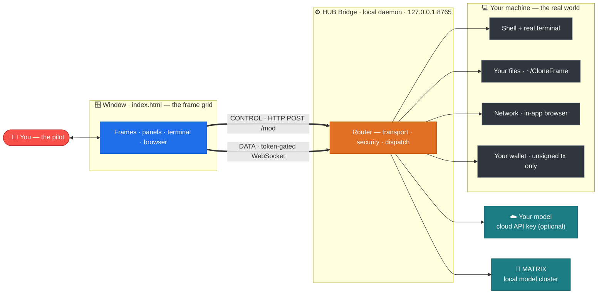

The window **never** talks to a tool's port directly. There are only **two channels**:
a **CONTROL** channel (HTTP `POST /mod/<name>` with a small `{fn, args}` body the
bridge dispatches to a named module) and one **DATA** channel (a single token-gated
WebSocket that powers the live terminal). Every call is Bearer-token checked,
Host-header checked, and loopback-only. Module functions whose name starts with `_`
are never reachable from the window.

---

## 🔐 The boundary law — two channels, nothing else

This is the single most important rule in the whole system, so it gets its own
picture. A malicious web page, another local user, or a rogue script has **no path**
to your machine that skips these checks.

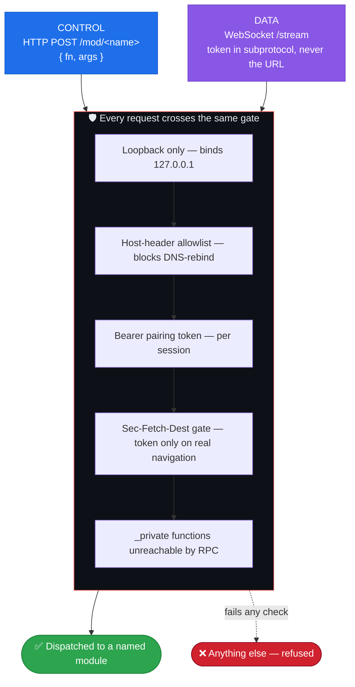

---

## 🪟 Inside the window

The interface is a single `index.html`, but it is not a blob — it is a small kernel,
a **panel registry**, and a fleet of self-contained panels. Every panel is registered
in one data-driven table and mounted on demand; adding a new one is a single line.

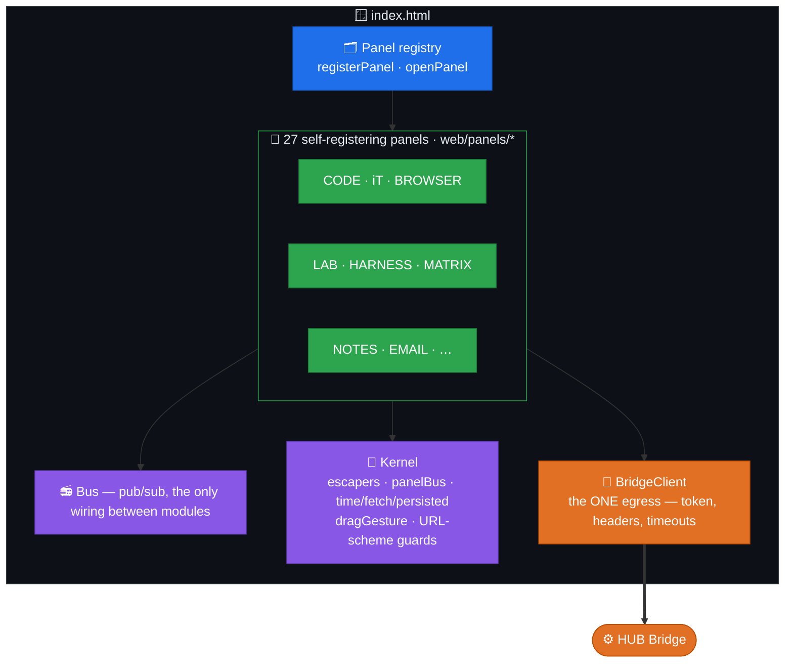

Every panel reaches the outside world through **one** client (`BridgeClient`), so
there is a single place where the pairing token, headers, and timeouts live. Panels
talk to each other only through the **Bus** — never by reaching into each other.

---

## ⚙️ Inside the bridge

The daemon is layered on purpose. The router does transport, security, and dispatch —
nothing else. Domain modules hold the meaning. Underneath them, a thin **platform
service layer** owns every mechanical concern (storage, HTTP, model calls, the safety
guard) so nothing is duplicated and every dangerous edge has exactly one home.

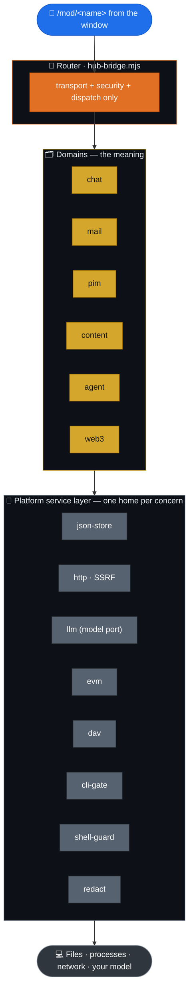

Because every dangerous operation funnels through one port — one SSRF check, one
catastrophic-command guard, one secret redactor, one fail-closed command gate — the
security promises below are **provable**, not scattered.

---

## 🧭 A request's journey

What actually happens when you type a command and press enter:

```mermaid
flowchart LR
    A["🖱️ You act in a panel"]:::a
    B["📡 BridgeClient adds the token"]:::b
    C["🚦 Router checks the gate"]:::c
    D["🗂️ Domain interprets {fn, args}"]:::d
    E["🔧 Platform port does the work"]:::e
    F["💻 Machine executes"]:::f
    G["🖥️ Result flows back to the frame"]:::g

    A --> B --> C --> D --> E --> F
    F -->|"{ ok, data }"| G --> A

    classDef a fill:#f85149,stroke:#b62324,color:#fff
    classDef b fill:#e16f24,stroke:#bc4c00,color:#fff
    classDef c fill:#cf222e,stroke:#82071e,color:#fff
    classDef d fill:#d4a72c,stroke:#9e6a03,color:#111
    classDef e fill:#576270,stroke:#32383f,color:#fff
    classDef f fill:#30363d,stroke:#8b949e,color:#fff
    classDef g fill:#2da44e,stroke:#1a7f37,color:#fff
```

Live terminal keystrokes take the **DATA** channel instead: they stream over the
token-gated WebSocket straight to a real pseudo-terminal, so the shell feels native —
your `zsh`, your prompt, `vim` and `tmux` all work.

---

## 🧱 The frame grid — 27 panels

Open the launcher and any of these mount instantly, each in its own draggable,
dockable frame. Dock one into a grid square and its live session keeps running.

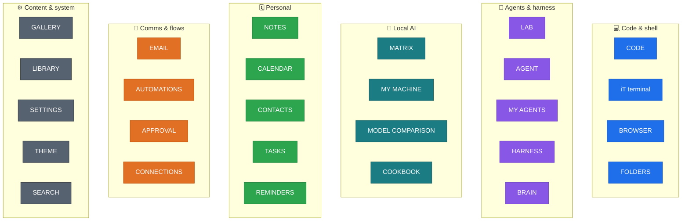

The four families you reach from the **top bar** are **CODE · HARNESS · LAB · MATRIX**;
the rest open from the launcher, the command palette, or Settings.

| Top-bar tab | What it gives you |
|-------------|-------------------|
| **CODE** | Chat with your model, a real multi-tab terminal (xterm, file tree, diff + editor, `zsh` themes, tab-autocomplete), a project diff view, and an in-app browser. |
| **HARNESS** | Crews of agents that plan and act behind **non-collapsible safety gates** — the agent proposes, the gate holds, you decide. |
| **LAB** | Chat with any model, and **your agents** — the LAB detects every iNFT your connected wallet holds and lets you work with each one. |
| **MATRIX** | Your **local AI cluster** — turn your own devices into nodes, load models, and chat with a fully local brain (details below). |

---

## 🧠 MATRIX — your local AI cluster

MATRIX turns the machines you own into one local inference cluster. Start the engine
on this Mac, add more nodes, load a model, and chat — no cloud key, nothing leaves
your hardware. When the engine is off, MATRIX shows clearly-labelled **demo data** so
you can see the shape before you go live.

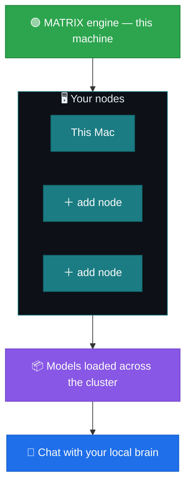

---

## 🧬 Bring your own model

CLONE FRAME does not ship a model. Every chat in the app routes to **the model you
chose** — the app itself is model-agnostic from end to end. Two ways to connect one:

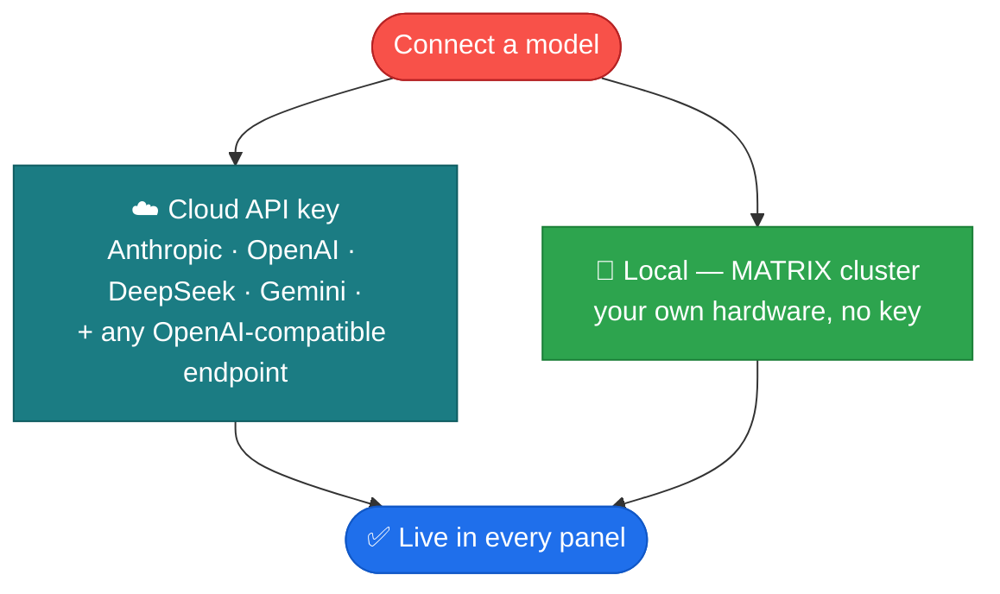

Your key stays in your **session** and is never written into the app, the logs, or
this repository. Full walkthrough: [docs/CONNECT.md](docs/CONNECT.md).

---

## 🛡️ Security model

Because every dangerous edge has exactly one home (see *Inside the bridge*), these
promises are enforced in one place each — and each one has a positive **and** a
negative regression test in the suite.

```mermaid
flowchart TD
    subgraph INV["🔒 Invariants — locked by tests"]
      direction TB
      I1["Loopback bind + pairing token"]
      I2["Sec-Fetch-Dest gate — token only on real navigation"]
      I3["SSRF re-checked on EVERY redirect hop"]
      I4["Soul / origin allowlist for privileged inputs"]
      I5["Command gate fails CLOSED"]
      I6["rm -rf / · mkfs · dd blocked — even in root mode"]
      I7["Secrets redacted from every log line"]
      I8["Media URL scheme guard — no javascript:/data:text/html"]
    end

    WALLET["👛 Wallet is the sole signer<br/>the app only builds UNSIGNED transactions"]:::wallet
    PERMS["🔘 Powerful things default OFF<br/>shell · file-write · web · email autonomy"]:::perms

    classDef inv fill:#cf222e,stroke:#82071e,color:#fff
    classDef wallet fill:#d4a72c,stroke:#9e6a03,color:#111
    classDef perms fill:#576270,stroke:#32383f,color:#fff
    class I1,I2,I3,I4,I5,I6,I7,I8 inv
    style INV fill:#0d1117,stroke:#cf222e,color:#e6edf3
```

- **Loopback only.** The bridge binds `127.0.0.1` and is reachable only from your own
  machine — never the network.
- **Paired and checked.** Every request carries a per-session pairing token and passes
  a Host-header allowlist that blocks DNS-rebinding. The WebSocket carries its token in
  the subprotocol (`cfhub.bearer.<token>`), never in the URL.
- **Powerful things default OFF.** Shell, file-write, web, and email autonomy are
  opt-in switches in Settings. Catastrophic commands are blocked even in root mode.
- **Sandboxed browser.** In-app pages render in an opaque-origin sandbox behind an
  SSRF-guarded proxy that re-validates on every redirect, so page JavaScript can never
  reach the token or the bridge.
- **Your secrets stay yours.** Keys live in your session or `.env` and are never
  written into the app, the logs, or this repository.
- **The wallet holds the keys, not the app.** CLONE FRAME only ever builds **unsigned**
  transactions — your connected wallet is the sole signer. The app never asks for a
  private key or seed phrase.

Full model and threat notes: [SECURITY.md](SECURITY.md).

---

## 🏗️ The single-file build

The app ships as **one** self-contained `index.html`, but it is *developed* as many
small files. A tiny build step reassembles them with a strict guarantee: the built
output is byte-for-byte reproducible, and a frozen checksum proves it never changed by
accident.

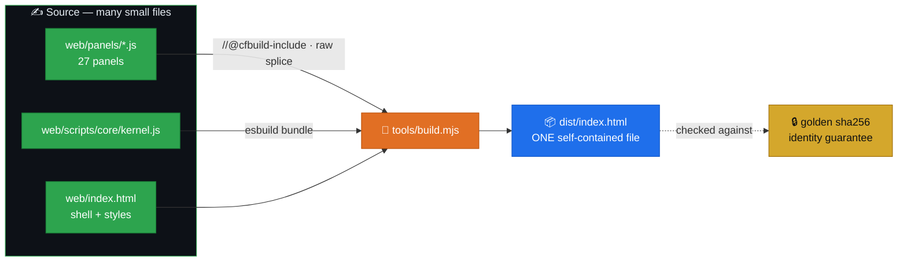

A fresh clone runs `dist/index.html` with **no build tools** — the panels are spliced
back into the same scope at build time, so the single-file app and the modular source
are always exactly the same program.

---

## 🧩 How it was built — eight layers

Under the hood the whole system is organised as eight layers, each resting on the one
below. This is why a change in one place cannot quietly break a distant panel.

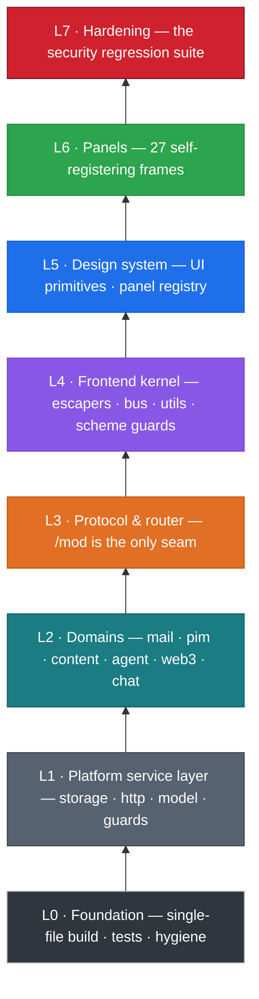

---

## 📦 Bundled integrations

The INTEGRATIONS panel installs and launches tools that run **inside** the app.

| Integration | Licence | What it does |
|-------------|---------|--------------|
| **MATRIX (local cluster)** | built-in | Serve local LLMs across your own devices — a fully local brain, no cloud key. |
| **Live Terminal** | built-in | A real interactive terminal — xterm.js over the token-gated WebSocket to a pseudo-terminal on the bridge. |
| **Framer** | bundled MV3 extension | Lets the in-app browser frame sites that normally block embedding. |
| **Runtime** | bundled | A Chrome for Testing the app launches into so the Framer extension can load. |

> [!NOTE]
> **Coming soon.** A few frames appear in the app as clearly-labelled **"in
> development"** placeholders — including **GAME OVER**, **ACP TRACER**, and **iIRYS
> FRAME**, plus deeper **Manaflow** (parallel coding agents) and **TMUX** (persistent
> agent crews) integrations. They are visible so you can see where the app is going;
> they are not wired to real actions yet.

---

## 🚀 Quick start

macOS is the primary platform today.

```bash
git clone https://github.com/devclone20/cloneframe_app_executable.git
cd cloneframe_app_executable/bridge && npm install   # only 3 optional email deps; rest is Node built-ins
./launch.sh                                            # starts the bridge on 127.0.0.1 and opens the app
# or build the double-click app:  cd bridge && ./make-app.sh   -> "CLONE FRAME HUB.app"
```

**Requirements:** Node ≥ 18 and a Chromium browser (Chrome, Brave, Edge, or Chrome
for Testing) for the app window.

On first run the app creates `~/CloneFrame/` (with `Models`, `Agents`, `Data`,
`Cache`, `Harnesses`, `Servers`, `Downloads`, `Logs`) — ordinary folders you can open
in Finder, that every frame reads from and writes to.

**Linux and Windows** are not the primary platform yet — the bridge is portable Node,
so it will run, but the launch and packaging scripts are macOS-first. See
[docs/INSTALL.md](docs/INSTALL.md) for the manual steps.

---

## 📚 Documentation

| Doc | What is inside |
|-----|----------------|
| [docs/HOW-IT-WORKS.md](docs/HOW-IT-WORKS.md) | A friendly tour of the app and its frames. |
| [docs/ARCHITECTURE.md](docs/ARCHITECTURE.md) | The two pieces, the two channels, and the boundary law in depth. |
| [docs/INSTALL.md](docs/INSTALL.md) | Install and run on macOS, Linux, and Windows. |
| [docs/CONNECT.md](docs/CONNECT.md) | Connect a cloud API key or a local MATRIX model. |
| [SECURITY.md](SECURITY.md) | The full security model and how to report issues. |

## License

Released under the **MIT License** — see [LICENSE](LICENSE). Third-party components
keep their own licences, listed in [THIRD-PARTY-NOTICES.md](THIRD-PARTY-NOTICES.md).

---

### ⭐ Support the developer

If CLONE FRAME HUB is useful to you, the best thanks is a star.

**⭐ Support the developer — [star this repo](https://github.com/devclone20/cloneframe_app_executable).**
