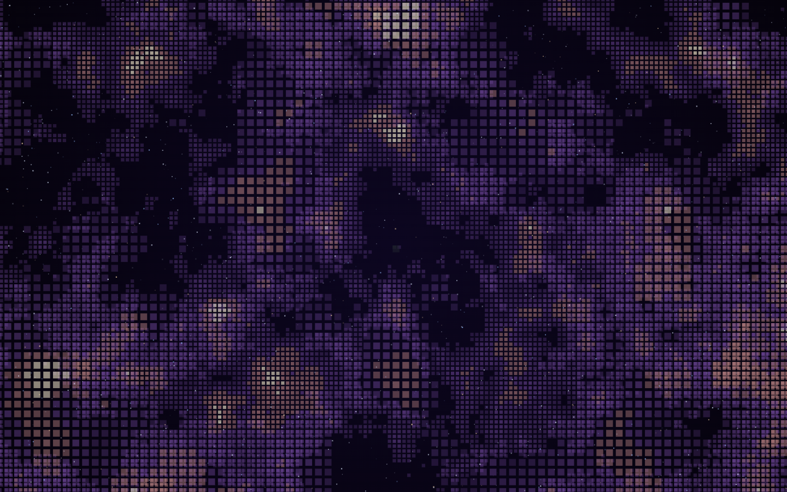
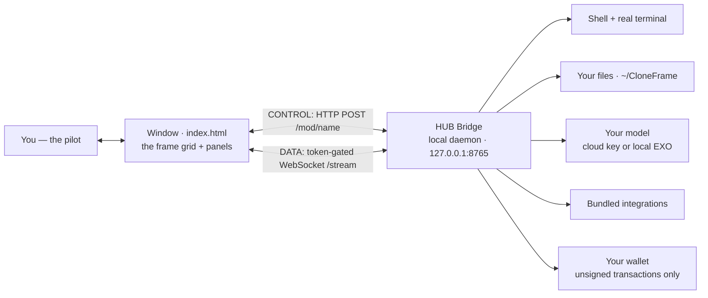
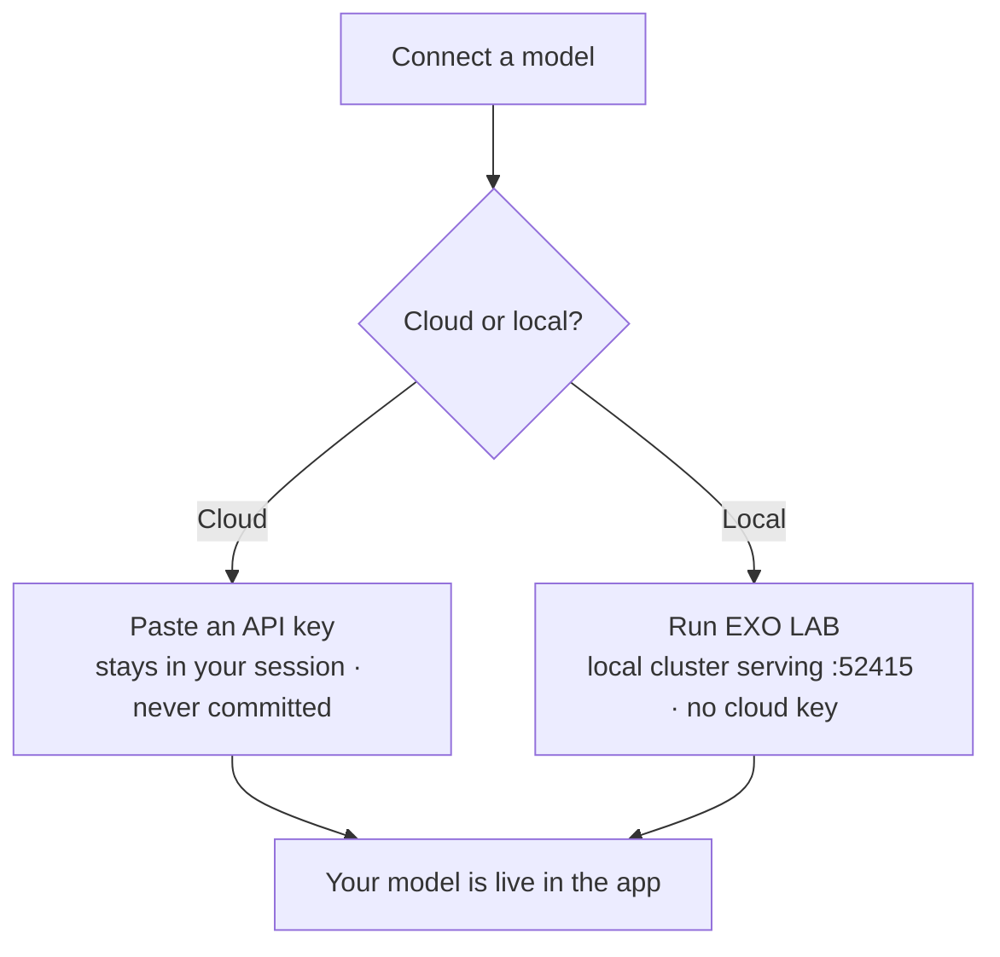

<p align="center"><em>Zoom all the way out and the app grid becomes a cosmic web — every square a frame waiting to be built.</em></p>

# CLONE FRAME · HUB

**A visual interface between you and your machine — a Unix with a face.**

[](LICENSE)
[](docs/INSTALL.md)
[](#)
[](#-support-the-developer)

> [!WARNING]
> **This is a PRODUCTION / PREVIEW build.** It is powerful, but **not yet fully ready
> for unattended production use**. Run it on a machine you trust, keep the powerful
> permissions off until you need them, and review what your agents do. You are the
> pilot — the app hands you the controls, it does not fly itself.

---

## What is this?

CLONE FRAME HUB is a local, double-click desktop app. It is made of exactly **two
pieces**: one `index.html` that draws the entire interface, and one small local
daemon — the **HUB Bridge** — that does the real work on your machine. Nothing runs
in the cloud unless you point it there.

Think of it as **Unix with a face**. Under the hood your computer already has a
shell, a filesystem, processes, and network tools. CLONE FRAME gives all of that a
calm, visual surface: a real terminal, a file tree, an in-app browser, email, crews
of agents with safety gates, and an on-chain economy panel — each one a frame in a
grid you can arrange and grow.

Crucially, **there is no embedded assistant**. You bring your own model. That can be
a cloud API key that never leaves your machine, or a fully local model served from
your own hardware. Your keys live in your session, your files live in plain folders
on your disk, and the app is built so that neither ever leaks into the code, the
logs, or this repository.

## The Universe in Frames

The interface is a grid of squares. **Each square is a frame** — an app, a tool, a
view you have opened or one you could build. A terminal is a frame. Your model chat
is a frame. A running local-model cluster is a frame. An agent crew is a frame.

Now zoom out. The single window you are looking at is one small patch of a much
larger picture: the **universe of everything you could build** on top of your own
machine. That is the cover concept — *The Universe in Frames*. Every empty square is
not a gap, it is an invitation.

## How it fits together



The window never talks to a tool's port directly. There are only **two channels**: a
**CONTROL** channel (HTTP `POST /mod/<name>` with a small `{fn, args}` body that the
bridge dispatches to a named module) and one **DATA** channel (a single token-gated
WebSocket that powers the live terminal). Every call is Bearer-token checked,
Host-header checked, and loopback-only. Module functions whose name starts with `_`
are rejected automatically.

## Features

Each top-bar tab is a family of frames.

| Tab | What it gives you |
|-----|-------------------|
| **CODE** | Chat with your model, a real multi-tab terminal (xterm, file tree, diff and editor, zsh themes, tab-autocomplete), a project diff view, and an in-app browser. |
| **HARNESS** | Crews of agents that plan and act behind **non-collapsible safety gates** — the agent proposes, the gate holds, you decide. |
| **LAB** | Local models, a cluster view of the devices serving them, and iNFT agent templates you can start from. |
| **CLI ECONOMY OS** | An on-chain agent economy as nested islands — VIRTUALS, ROBINHOOD, OKX AI, plus **My iNFT** to build, deploy, and detect agents already held in your connected wallet. Builds **unsigned** transactions only. |
| **INTEGRATIONS** | Install and launch bundled tools, each embedded and running inside the app (see the list below). |
| **Email** | Bring your own SMTP/IMAP — your inbox, your credentials, on your machine. |
| **Automations** | Scheduled tasks that run on a timer you set. |
| **Folders** | A file manager over the plain `~/CloneFrame` folders every part of the app shares. |

On first run the app creates `~/CloneFrame/` (with `Models`, `Agents`, `Data`,
`Cache`, `Harnesses`, `Servers`, `Downloads`, `Logs`) — ordinary folders you can open
in Finder, that every frame reads from and writes to.

### Bundled integrations

| Integration | Licence | What it does |
|-------------|---------|--------------|
| **EXO LAB** | Apache-2.0 | Run a local LLM cluster across your own devices, serving an API on `:52415`, opened inside the app. This is how you run a fully local model with no cloud key. |
| **Manaflow / cmux** | MIT | Spawn parallel coding agents. Runs **without Docker** via the Convex CLI's anonymous local deployment. |
| **TMUX** | MIT | Persistent agent crews in tmux windows that survive disconnects, with a native panel and a live "▸ Live" terminal. |
| **Framer** | bundled MV3 extension | Lets the in-app browser frame sites that normally block embedding. |
| **Runtime** | bundled | A Chrome for Testing that the app launches into so the Framer extension can load. |
| **Live Terminal** | built-in | A real interactive terminal in the app — xterm.js over the token-gated WebSocket to node-pty on the bridge. Powers TMUX "▸ Live". |

## Quick start

macOS is the primary platform today.

```bash
git clone https://github.com/devclone20/cloneframe_app_executable.git
cd cloneframe_app_executable/bridge && npm install   # only 3 optional email deps; rest is Node built-ins
./launch.sh                                            # starts the bridge on 127.0.0.1 and opens the app
# or build the double-click app:  cd bridge && ./make-app.sh   -> "CLONE FRAME HUB.app"
```

**Requirements:** Node ≥ 18 and a Chromium browser (Chrome, Brave, Edge, or Chrome
for Testing) for the app window.

**Linux and Windows** are not the primary platform yet — the bridge is portable Node,
so it will run, but the launch and packaging scripts are macOS-first. See
[docs/INSTALL.md](docs/INSTALL.md) for the manual steps.

## Bring your own model

CLONE FRAME does not ship a model. You choose how to connect one:



Full walkthrough: [docs/CONNECT.md](docs/CONNECT.md).

## Security in one minute

- **Loopback only.** The bridge binds `127.0.0.1` and is reachable only from your own
  machine — never the network.
- **Paired and checked.** Every request carries a per-session pairing token and passes
  a Host-header allowlist that blocks DNS-rebinding. The WebSocket carries its token in
  the subprotocol (`cfhub.bearer.<token>`), never in the URL.
- **Powerful things default OFF.** Shell, file-write, web, and email autonomy are
  opt-in switches in Settings. Catastrophic commands (`rm -rf /`, `mkfs`, `dd` to a
  disk) are blocked even in root mode.
- **Sandboxed browser.** In-app pages render in an opaque-origin sandbox behind an
  SSRF-guarded proxy, so page JavaScript can never reach the token or the bridge.
- **Your secrets stay yours.** Keys live in your session or `.env` and are never
  written into the app, the logs, or this repository.
- **The wallet holds the keys, not the app.** CLONE FRAME only ever builds **unsigned**
  transactions — your connected wallet is the sole signer. The app never asks for a
  private key or seed phrase.

Full model and threat notes: [SECURITY.md](SECURITY.md).

## Documentation

| Doc | What is inside |
|-----|----------------|
| [docs/HOW-IT-WORKS.md](docs/HOW-IT-WORKS.md) | A friendly tour of the app and its frames. |
| [docs/ARCHITECTURE.md](docs/ARCHITECTURE.md) | The two pieces, the two channels, and the boundary law in depth. |
| [docs/INSTALL.md](docs/INSTALL.md) | Install and run on macOS, Linux, and Windows. |
| [docs/CONNECT.md](docs/CONNECT.md) | Connect a cloud API key or a local EXO model. |
| [SECURITY.md](SECURITY.md) | The full security model and how to report issues. |

## License

Released under the **MIT License** — see [LICENSE](LICENSE). Third-party components
keep their own licences, listed in [THIRD-PARTY-NOTICES.md](THIRD-PARTY-NOTICES.md).

---

### ⭐ Support the developer

If CLONE FRAME HUB is useful to you, the best thanks is a star.

**⭐ Support the developer — [star this repo](https://github.com/devclone20/cloneframe_app_executable).**