# CLONE FRAME · HUB — Architecture

> **Status: PRODUCTION / PREVIEW.** CLONE FRAME · HUB is powerful, but it is **not yet fully ready for unattended production use**. It runs real shell commands, drives real agents, and talks to real on-chain wallets on your own machine. Treat it as a sharp instrument: keep the dangerous switches off until you need them, watch what your agents do, and never point it at anything you cannot afford to lose. This document explains exactly how the machine is built so you can trust it *because* you understand it — not in spite of not understanding it.

CLONE FRAME · HUB is a **local, double-click desktop app** that turns your personal machine into an AI-agent workstation. Its tagline says it plainly: *a visual interface between you and your machine — a Unix with a face.*

This page is the deep, honest tour of how that face is wired to the machine underneath. We start from one big picture, then take it apart, one focused diagram at a time.

---

## The whole thing in two pieces

There are only **two** moving parts. Everything else is a detail of these two.

| Piece | What it is | Where it lives |
|---|---|---|
| **The window** | `index.html` — the *entire* UI: the frame grid, every panel, the terminal, the browser. One single file. | Your Chromium browser, opened as an app window |
| **The HUB Bridge** | A small, near-zero-dependency Node daemon that gives the window a *body* on your machine — it runs shells, spawns agents, reads files, relays to your model. | A local process bound to `127.0.0.1:8765` |

The window can *see and describe*; the bridge is the only thing that can *act*. They are paired by a per-session token, and they talk over exactly **two channels** — no more. That discipline is the heart of the design, and we will keep coming back to it.

There is **no assistant baked in.** You bring your own model: an API key that never leaves the disk, or a fully local model served from your own hardware through EXO LAB. The bridge only ever *relays* to whichever brain you connected.

---

## (A) The big picture

Here is the complex diagram — the one everything else decomposes from. Read it top to bottom: your window on top, the bridge in the middle enforcing every rule, your machine's real resources at the bottom.

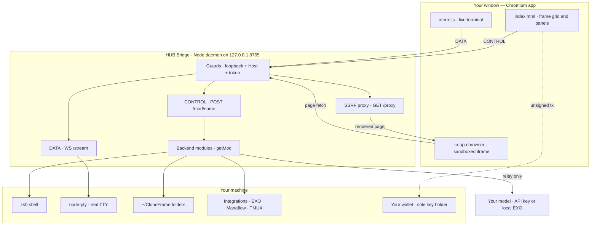

**In plain English.** The window never reaches into the machine directly. Every keystroke, command, file read, agent launch, and model prompt is funnelled through the bridge's guard layer first. The bridge then hands the request to the right worker: the shell, a real terminal, the filesystem, an integration, or a relay out to your chosen model. Two things it deliberately does **not** touch: your model's API key travels no further than the relay, and your wallet's private key is never held — the window builds an *unsigned* transaction and your wallet alone signs it.

---

## (B) The Boundary Law

The single most important rule in the whole system:

> **The UI never talks to a tool's port directly. There are only two channels.**

Not the EXO port, not the Manaflow port, not the terminal's PTY — nothing. If the window wants something to happen on the machine, it must go through one of two doors.

| Channel | Verb | Route | Carries | Used for |
|---|---|---|---|---|
| **CONTROL** | HTTP `POST` | `/mod/<name>` with body `fn` + `args` | JSON in, JSON out | Every command, every module function |
| **DATA** | WebSocket | `GET /stream` | Raw bytes | The live interactive terminal |

Everything that has side effects rides the CONTROL channel. Only the live terminal — which needs a raw, continuous byte stream — gets the DATA channel.

### How a CONTROL call works

`POST /mod/tasks` with a body of `{ fn: "list", args: [] }` becomes, on the bridge, `getMod("tasks")["list"]()`. It is a tiny, uniform remote-procedure bridge. Two safety rails matter:

1. **Underscore functions are auto-rejected.** Any `fn` beginning with `_` (or named `constructor`) is refused before dispatch. Modules use the `_` prefix for their private, server-only internals — path resolvers, secret readers — so the naming convention *is* the access-control boundary.
2. **Every call is Bearer-token + Host-checked** before it reaches the router at all.

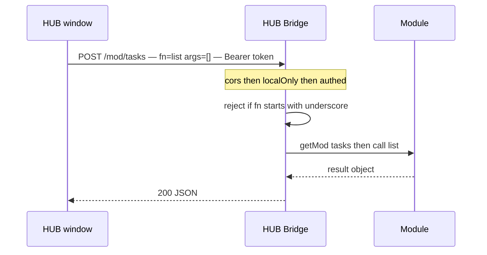

### How the window gets paired

Before any of that can work, the window needs the token. It never types it in and it never appears in a URL you could copy by accident. Instead, when the bridge serves `index.html` **as a real top-level navigation** — the browser sends `Sec-Fetch-Dest: document`, which page `fetch()` calls cannot forge — the bridge injects the token straight into that one trusted page:

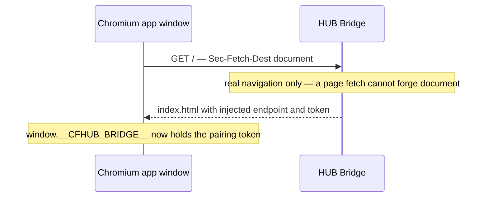

The token itself is generated once, stored at `~/.clone-frame-hub/bridge.token` with `chmod 600`, and reused across restarts.

### How the DATA channel is paired

The live terminal opens the *one* WebSocket. Crucially, the token travels in the **WebSocket subprotocol** — `cfhub.bearer.<token>` — and **never in the URL**. URLs get logged, proxied, and leaked; subprotocols do not. The upgrade repeats *every* HTTP guard, then hands the raw socket to the PTY engine.

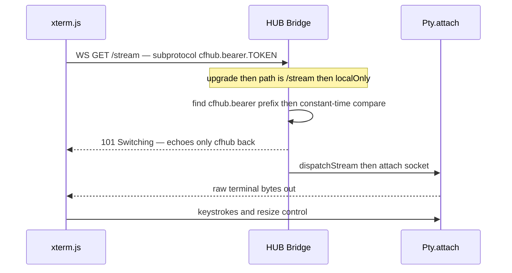

Only the non-secret `cfhub` subprotocol is echoed back to the client — the secret half is verified and discarded.

---

## (C) The security layers

Security here is not a feature bolted on; it is a sequence of gates every request must pass. The defaults are deliberately timid: **shell execution, root/sudo, web access, and email autonomy all ship OFF** and are opt-in switches in Settings.

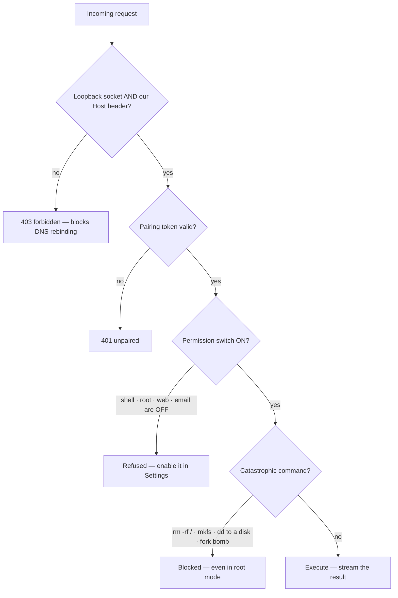

**In plain English:**

- **Loopback-only + Host allowlist.** The bridge binds `127.0.0.1` and additionally checks the `Host` header is exactly our loopback address. A malicious website that rebinds its DNS to `127.0.0.1` still sends *its own* hostname, so it fails the Host check. This is the anti-DNS-rebinding lock.
- **Pairing token.** A constant-time comparison against the per-session token. No token, no action.
- **Permissions default OFF.** The powerful capabilities are switches you must consciously flip. A fresh install cannot run a shell command, `sudo`, browse the web, or send email on its own.
- **Catastrophic-command block.** Even with root mode on, a hard pattern guard refuses the truly unrecoverable: `rm -rf /` and friends, `mkfs`, `dd` writing to a raw disk, classic fork bombs. This guard is applied identically by the `/shell` route **and** the PTY engine, as defence in depth.

### The browser has its own lane

The in-app browser is the one place untrusted web content enters, so it gets a separate, stricter path. The proxy route `/proxy` is deliberately **token-less** — because the token must never sit in an iframe URL where the proxied page's own JavaScript could read `location.search`. It stays safe through a different stack of locks:

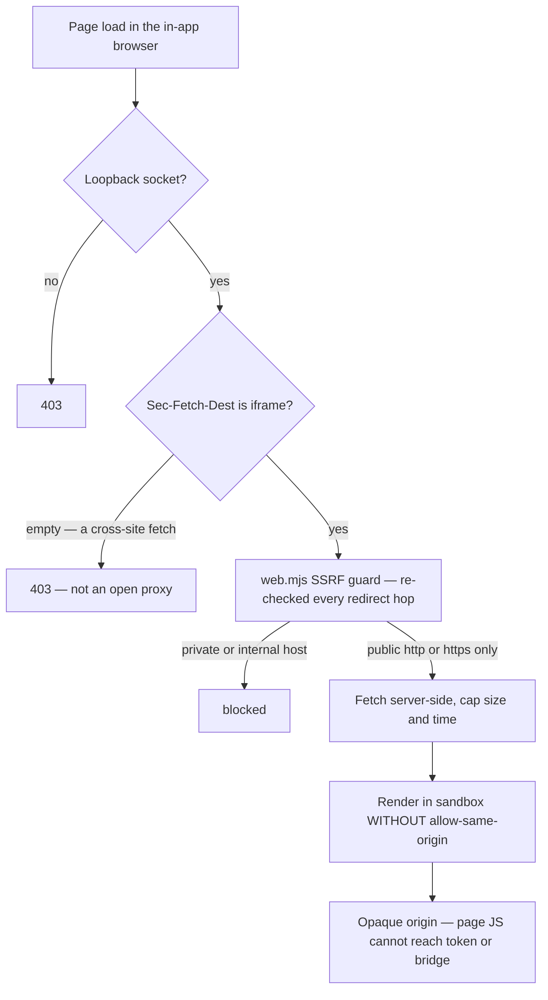

Because the sandbox omits `allow-same-origin`, the proxied page runs at an **opaque origin**: its JavaScript cannot read the parent window, the token, or authenticate to any bridge route. And because the SSRF guard re-validates on every redirect hop, a page cannot bounce the fetch toward `169.254.169.254` (cloud metadata), `localhost`, or any private range.

Secrets, throughout, live only in your session and your `~/.env` — never written into the app, the logs, or the repository. The connected wallet is the sole key holder; the app builds unsigned transactions only.

---

## (D) The live terminal — Foundation #37

The live terminal is the only consumer of the DATA channel. It is a *real* interactive TTY — TUIs, colours, resizing, Ctrl-C, the lot — because behind it is `node-pty`, a genuine pseudo-terminal.

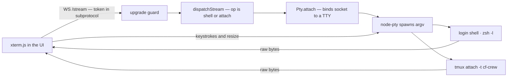

**In plain English.** `xterm.js` in the window opens the token-gated WebSocket. The bridge's upgrade handler validates it and calls `dispatchStream`, which decides what to launch: a fresh login shell (`op=shell`), or an attach to an existing tmux crew (`op=attach`, session name validated against `cf-*`). `Pty.attach` then wires the socket to the TTY both ways — PTY output flows out as raw bytes, your keystrokes flow in. This is exactly what powers the TMUX integration's **▸ Live** button: it opens the same `/stream` channel with `op=attach`.

The engine is careful about resources: at most 12 concurrent sessions, a 30-minute idle reap, a 12-hour hard lifetime cap, and per-socket backpressure so a runaway process cannot flood the WebSocket. `node-pty` is spawned as an argv array — never `sh -c` — so there is no shell-injection surface in the terminal path itself.

---

## (E) The integrations map

> [!NOTE]
> **EXO LAB, Manaflow and TMUX are currently "coming soon."** They appear in the
> INTEGRATIONS tab as placeholders and are **not bundled in this build yet** — no
> module, no source. The details below describe how each will work once it ships.

Integrations are bundled tools that install into their own folder and launch through their own bridge module. The repository ships **only manifests and installers** — no giant binaries, no secrets committed. Each `install.sh` clones its upstream into `integrations/<name>/src/` and builds it there, preserving the upstream licence.

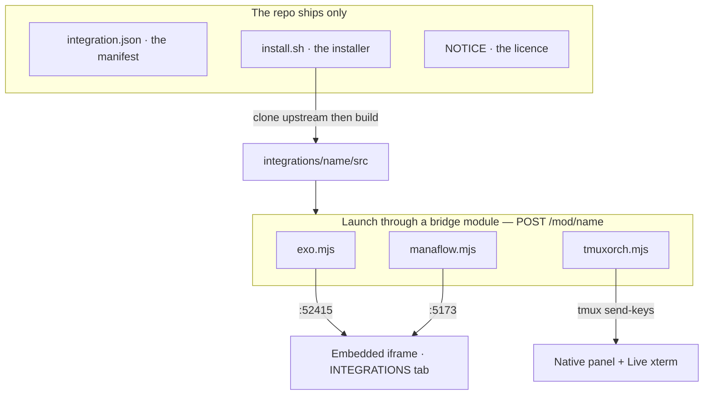

The boundary law holds even here: the window never fetches an integration's port. It speaks only `POST /mod/exo`, `/mod/manaflow`, `/mod/tmuxorch`. The *only* contact with an integration's origin is the `<iframe src>` — a browsing-context navigation that is cross-origin and therefore cannot read the HUB token.

### Ports and how each tool opens

| Tool | Licence | Port | Bind | Opens in | Notes |
|---|---|---|---|---|---|
| **HUB Bridge** | — | `8765` | `127.0.0.1` | serves the app | The one daemon; also hosts `/stream` |
| **EXO LAB** | Apache-2.0 | `52415` | loopback | in-app iframe | Your fully local model cluster — no cloud key needed |
| **Manaflow / cmux** | MIT | `5173` | loopback | in-app iframe | Vite web client; see (F) |
| Manaflow · server | MIT | `9776` | loopback | — | API service |
| Manaflow · www | MIT | `9779` | loopback | — | Marketing/app www |
| Manaflow · Convex | MIT | `3210` | loopback | — | Anonymous **local** data layer, no Docker |
| **TMUX** (Orchestrator) | MIT | none | — | native panel | Pattern over `tmux send-keys`; **▸ Live** attaches a real xterm |
| **Framer** | MIT | none | — | Chrome extension | MV3 extension that lets the browser frame anti-embedding sites |
| **Runtime** | Chrome for Testing ToS | none | — | launched app | Bundled Chromium the app opens so Framer can load |

Every integration module spawns with `shell: false` and argv arrays — no string interpolation, no injection surface. TMUX in particular hard-scopes all crew operations to the `cf-*` namespace: it will `list` and `kill` only sessions it created and will never touch your own tmux sessions, and never `kill-server`.

---

## (F) Manaflow without Docker *(coming soon)*

Manaflow is the exception among the integrations: it is not a single self-contained server but a **Bun monorepo of several services**, and upstream it normally wants Docker. CLONE FRAME runs it **without Docker** by using Convex's own CLI to stand up an *anonymous local deployment* for the data layer.

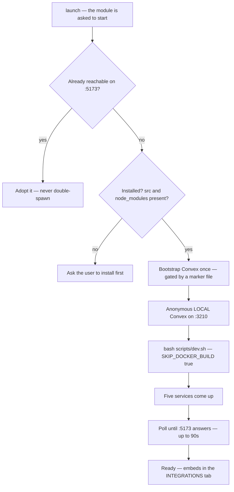

**In plain English.** When you press Launch, the module first checks whether Manaflow is *already* running and simply adopts it if so — it never spawns a duplicate. Otherwise it does a one-time, marker-gated Convex bootstrap (so later launches skip it), then runs the upstream `scripts/dev.sh` under `bash` with `SKIP_DOCKER_BUILD=true` and `CONVEX_AGENT_MODE=anonymous`. That brings up the five local services — **client `5173`, server `9776`, www `9779`, and the anonymous local Convex on `3210`**. Because a GUI-launched daemon inherits a minimal `PATH`, the module carefully prepends the directories where `bun`, a supported Node (18/20/22/24), and the Rust toolchain actually live, so the build works regardless of how the bridge was started.

Manaflow needs a free Hexclave / Stack Auth project (three keys) for sign-in, and your own Anthropic key or Claude Code OAuth token added in-app to actually run agents. The module reports these prerequisites as **booleans only** — it parses the `.env` to know *whether* a key is present, and never reads or returns the secret value itself.

---

## The folder system

On first run the app materialises a plain, Finder-visible folder tree at `~/CloneFrame/`. These are ordinary folders — every part of the app reads and writes them, and so can you, directly on disk.

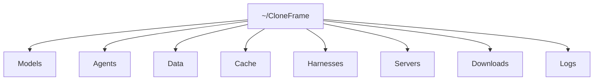

Separately, `~/.clone-frame-hub/` holds the bridge's own runtime state — the `bridge.token` (chmod 600) and integration bookkeeping. Your workspace is visible; the bridge's private keyring is not.

---

## (G) The Universe in Frames

Everything above is one workstation of frames. The cover concept — *the Universe in Frames* — is what you see when you zoom the grid all the way out: each square is a frame, and the empty ones are invitations.

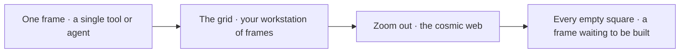

A single frame is a tool or an agent. Zoom out and the frames become your workstation. Zoom out further and the grid becomes a cosmic web — every square a place where something could live. The architecture in this document is simply the physics of that universe: two channels, one guarded bridge, your machine underneath, and your model as the light you bring to it.

---

**⭐ Support the developer — star this repo.**