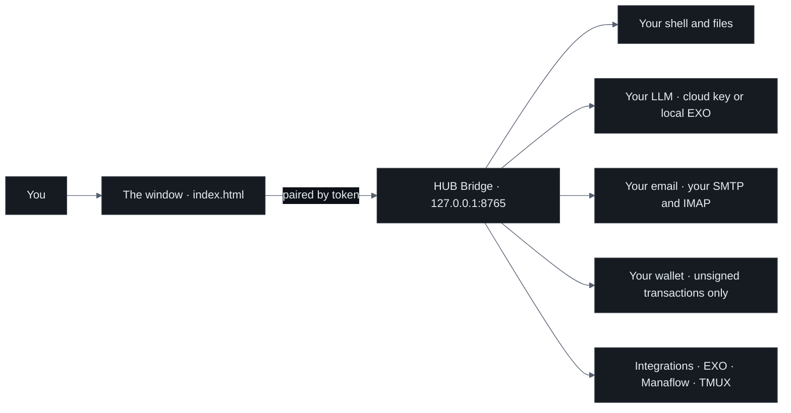
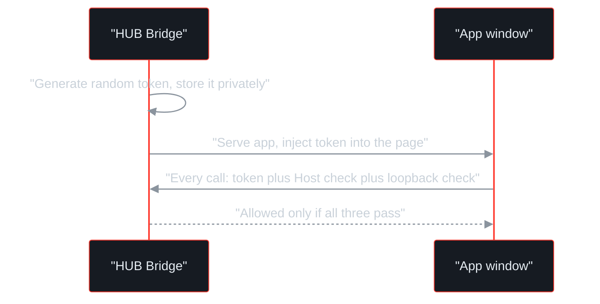
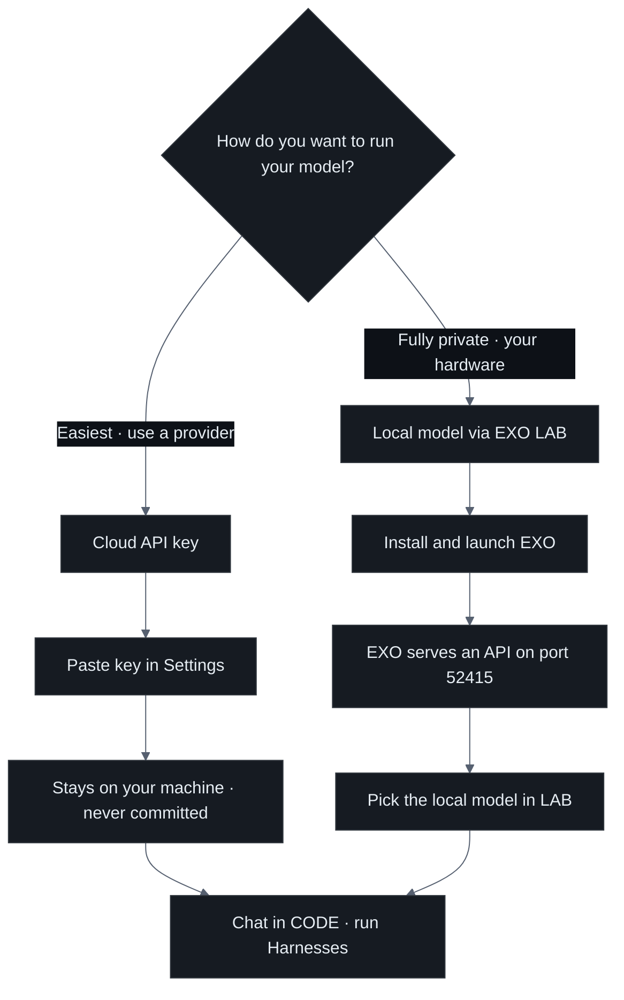
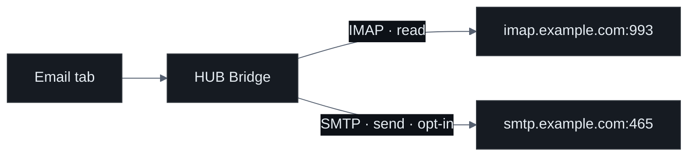
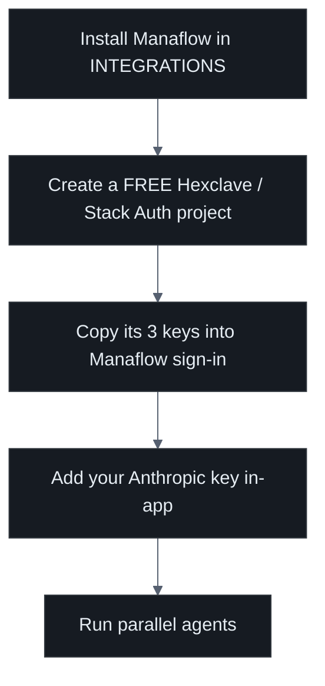
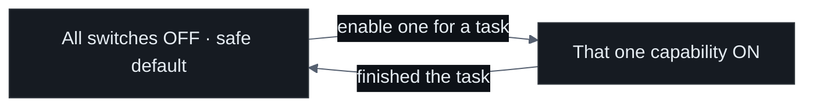

<p align="center">
  
</p>

# Connect · CLONE FRAME · HUB

**A visual interface between you and your machine — a Unix with a face.**

This is the patient, step-by-step guide to *connecting* CLONE FRAME HUB: to your
machine, to your own AI model, and to the outside world. If you have never run a
local daemon or pasted an API key before, you are in the right place. We assume
you are smart but new to all of this, and we move one careful step at a time.

> ### ⚠️ Preview / Production notice
> CLONE FRAME HUB is **powerful, but not yet fully ready for unattended
> production use**. It hands a capable AI a real terminal on your real computer.
> Read each step, keep every permission **OFF** until you need it, and never walk
> away from an agent that has shell or web access enabled. Treat this as a
> preview you supervise, not an autopilot.

---

## Before you start

You only need three things:

| You need | Why |
|---|---|
| **Node ≥ 18** | Runs the HUB Bridge (the local daemon). |
| **A Chromium browser** (Chrome, Brave, Edge, or Chrome for Testing) | Draws the app window. |
| **One thing to connect a model with** | Either a cloud **API key**, or your own hardware to run a **local model** via EXO LAB. |

If the app is not running yet:

```bash
git clone https://github.com/devclone20/cloneframe_app_executable.git
cd cloneframe_app_executable/bridge
npm install          # only three optional email deps; the rest is Node built-ins
./launch.sh          # starts the bridge on 127.0.0.1 and opens the app window
```

Everything below happens **inside** that window, in **Settings** and the top-bar
tabs. Nothing here asks you to open a port to the internet.

---

## The big picture: what connects to what

There are only ever **two pieces**: the **window** (the `index.html` UI) and the
**HUB Bridge** (a small local Node daemon). The Bridge is the only thing that
touches your machine and the outside world. The window asks the Bridge; the
Bridge does the work.



Two rules make this safe, and they never bend:

1. **The Bridge listens on `127.0.0.1` only.** Nothing is exposed to your network
   or the internet. A website you visit cannot reach it.
2. **The window never talks to a tool's port directly.** It goes through the
   Bridge over exactly two channels — a **CONTROL** channel and a **DATA**
   channel — described next.

---

## 1 · Pairing — how the window learns to trust the Bridge

"Pairing" is how the window proves, on every request, that it is *your* window
and not some web page pretending to be it. You do not type anything for this.
It happens automatically the moment the app opens.

**How it works, in plain terms:**

- On first run the Bridge generates a **random per-session token** and keeps it
  in its own private config file with tight permissions. Your key material, and
  this token, stay on your machine.
- When the Bridge serves the app to a **real top-level browser window**, it
  injects that token into the page as `window.__CFHUB_BRIDGE__`. Now the window —
  and only the window — knows the token.
- From then on, **every** request the window makes to the Bridge must carry that
  token, *and* arrive on loopback, *and* present the correct `Host` header.



### The two channels (the "boundary law")

| Channel | Path | Used for | Guard |
|---|---|---|---|
| **CONTROL** | `POST /mod/<name>` with body `{fn, args}` | Every command — models, files, email, wallet, tools | Token + `Host` allowlist + loopback. Functions whose name starts with `_` are auto-rejected. |
| **DATA** | one WebSocket at `GET /stream` | The live terminal (and TMUX "▸ Live") | The token travels in the WebSocket **subprotocol** `cfhub.bearer.<token>`, **never in the URL**. The upgrade repeats every guard above. |

**Why you can relax about it:** the token is never in a URL (so it cannot leak
into logs or a proxied page), the `Host` allowlist blocks DNS-rebinding tricks,
and the in-app browser renders pages in a sandbox that cannot see the token at
all. You never manage any of this by hand.

### Why a window sometimes will not pair

The Bridge hands the token to a page **only** when the request is a genuine
navigation a *person* performed. Browsers mark those with `Sec-Fetch-User: ?1`,
and the Bridge requires it — along with a top-level document navigation, and a
pairing latch that is armed for 120 seconds after launch and spent by the first
window that takes it.

That third condition is the one that surprises people, and it is deliberate: a
page opened by a script, by automation, or fetched with `curl` will **never** be
given the token, no matter how many times it retries. It is what stops other
software on your machine from quietly taking control of the app.

So there is nothing to work around. If a window shows **WEB** in the bottom-right
instead of **APP**, launch it again through `./launch.sh` or the app icon — that
arms the latch and opens a real window. Needing a second window while one is
already running is fine; the launcher re-arms the latch by proving ownership of
the token file.

**What you might see:** a bottom-right badge reading `APP` when paired and `WEB`
when not. A terminal pane distinguishes *"HUB Bridge session expired"* (it was
paired, the token has moved on — relaunch) from *"HUB Bridge not connected"*
(the daemon is not running — start it). And `/health` reports `"stale": true`
when the files on disk are newer than the running daemon: restart the daemon,
because reloading the window is not enough.

---

## 2 · Connecting your LLM

CLONE FRAME HUB ships with **no model inside it**. You bring your own brain for
the app. There are two ways, and you can switch between them at any time.



### 2a · A cloud API key (Anthropic, OpenAI, others)

This is the quickest path.

1. Open **MY MACHINE** and go to **BRAIN**.
2. Paste your key. The app detects the provider from the key's shape — Anthropic
   `sk-ant-…`, OpenAI `sk-…`, and so on — and you can also pick it by hand.
3. Press **CONNECT**. The app asks *your provider* which models that key may
   call, and stores the list. **A key the provider rejects is not stored**: you
   are told at that moment, in the provider's own words, rather than discovering
   it on your first message.
4. Choose the model on that row.
5. Go to **CODE** or **LAB** and send a message to confirm it answers.

Each key has an **ON / OFF** switch. OFF parks it — the key is kept, nothing
routes to it, one click brings it back. Pasting a new key for a provider that
already has one replaces it. This is how you swap a key without losing the one
you had.

**Which model answers what** lives in **Settings → AI Defaults**. *Chat* is the
general default: everything not listed there follows it, including research,
recipes and comparisons. Leave a row unset and it follows Chat; leave Chat unset
and the app uses the first provider you added, then falls back to a key in
`~/.env.local`.

**Where your key lives — and where it does not:**

| Your key **is** | Your key is **never** |
|---|---|
| Held in your machine's session / your own `~/.env.local` | Written into `index.html` or any app file |
| Sent only from the Bridge, directly to your provider | Written into logs |
| Yours to rotate or delete any time | Committed to this repository |

> The Bridge is deliberately built to **never log your key**. If you ever want to
> revoke access, rotate the key at your provider — the app holds no copy it can
> leak.

### 2b · A fully local model via EXO LAB *(coming soon)*

If you would rather **no cloud key at all**, run the model on your own hardware.
EXO LAB clusters your own devices and serves a local model API.

1. Go to the **INTEGRATIONS** tab and install **EXO LAB** (see §6).
2. Launch it. EXO serves its API on **`127.0.0.1:52415`** and opens **inside**
   the app.
3. Go to **LAB**, and under local models select the model EXO is serving.
4. Chat in **CODE** as usual — now nothing leaves your machine at all.

| Cloud key | Local via EXO |
|---|---|
| Fastest to set up | Fully private, no third party |
| Needs an account and key | Needs your own hardware |
| Costs per use at the provider | Costs only your electricity |
| `sk-ant-YOURKEY` in Settings | Nothing to paste — select it in LAB |

---

## 3 · MCP servers (giving your agents extra tools)

**MCP** (Model Context Protocol) is a simple standard that lets your model call
external **tools** — for example a documentation search, a database reader, or a
custom internal tool — through a small server.

In CLONE FRAME HUB, MCP tools are **opt-in** and **run locally** alongside the
Bridge; the model reaches them only when you have pointed the app at a server and
switched the relevant permission on.

**To connect one:**

1. Run or install the MCP server you want, so it is listening locally.
2. In **Settings**, open the **MCP** section and add the server by its local
   address, using a placeholder shape like:
   - command server → `mcp: node ./your-mcp-server.mjs`
   - URL server → `http://127.0.0.1:YOUR_MCP_PORT`
3. Give it a name you will recognise, and save.
4. The server's tools now appear for your agents to use — and **only** when the
   matching permission (for example web or file access) is enabled.

```mermaid
%%{init: {'theme':'base','themeVariables':{'background':'#0d1117','mainBkg':'#161b22','primaryColor':'#161b22','primaryBorderColor':'#ff3b30','primaryTextColor':'#e6edf3','nodeBorder':'#30363d','nodeTextColor':'#e6edf3','lineColor':'#566070','secondaryColor':'#161b22','tertiaryColor':'#0d1117','clusterBkg':'#10151c','clusterBorder':'#30363d','titleColor':'#e6edf3','edgeLabelBackground':'#0d1117','fontFamily':'ui-monospace, SFMono-Regular, Menlo, monospace','actorBkg':'#161b22','actorBorder':'#ff3b30','actorTextColor':'#e6edf3','signalColor':'#8b949e','signalTextColor':'#c9d1d9','labelBoxBkgColor':'#161b22','labelBoxBorderColor':'#30363d','labelTextColor':'#e6edf3','loopTextColor':'#e6edf3','noteBkgColor':'#1c2028','noteBorderColor':'#e8b86d','noteTextColor':'#c9d1d9','activationBkgColor':'#30363d','activationBorderColor':'#8b949e','sequenceNumberColor':'#0d1117'}}}%%
flowchart LR
  Agent["Your agent"] --> Bridge["HUB Bridge"]
  Bridge -->|"opt-in, local only"| MCP["Your MCP server · 127.0.0.1:YOUR_MCP_PORT"]
  MCP --> Tool["The tool it exposes"]
```



> Keep MCP servers local and trusted. A tool server can do whatever its code
> does, so only add ones you understand. Nothing here should point at a public
> endpoint you do not control.

---

## 4 · Email (bring your own SMTP and IMAP)

CLONE FRAME HUB does not run an email account for you. You connect **your own**
mailbox with standard settings, so your mail stays with your provider.

**What you will need from your email provider:**

| Field | Example placeholder | Notes |
|---|---|---|
| IMAP host | `imap.example.com` | For reading mail. |
| IMAP port | `993` | Usually 993 (TLS). |
| SMTP host | `smtp.example.com` | For sending mail. |
| SMTP port | `465` or `587` | Your provider will say which. |
| Username | `you@example.com` | Your address. |
| **App password** | `YOUR_APP_PASSWORD` | An **app-specific password**, not your main login. |

**Steps:**

1. In **Settings**, open the **Email** section.
2. Fill in the host, port, and username fields above.
3. In the password field, paste an **app password** you generated at your
   provider — for example Gmail "App passwords" or your host's equivalent.
4. Save, then use the **Email** tab to read your inbox.

> ### 🔐 Use an app password, never your main password
> An app password is a single-purpose credential you can revoke on its own,
> without changing your real account password or affecting your other logins.
> Always use one here. If you ever want to disconnect, revoke that one app
> password at your provider and it is gone.

**Sending is a separate, opt-in permission.** Reading your inbox does not let the
app send anything. The app will only send email when **you** have enabled the
email-autonomy switch (see §7) — and, in line with safe practice, you confirm
messages that go out on your behalf.



---

## 5 · Wallet (for the CLI ECONOMY OS)

The **CLI ECONOMY OS** tab lets agents take part in an on-chain economy
(the VIRTUALS, ROBINHOOD, and OKX AI islands, plus your own iNFT agents). To use
it, you connect a wallet — and the security model here is strict and simple.

**The one rule that matters:** the app **only ever builds *unsigned*
transactions**. It **never** holds, asks for, or stores your **seed phrase or
private key**. You approve every signature yourself, in your own wallet.

```mermaid
%%{init: {'theme':'base','themeVariables':{'background':'#0d1117','mainBkg':'#161b22','primaryColor':'#161b22','primaryBorderColor':'#ff3b30','primaryTextColor':'#e6edf3','nodeBorder':'#30363d','nodeTextColor':'#e6edf3','lineColor':'#566070','secondaryColor':'#161b22','tertiaryColor':'#0d1117','clusterBkg':'#10151c','clusterBorder':'#30363d','titleColor':'#e6edf3','edgeLabelBackground':'#0d1117','fontFamily':'ui-monospace, SFMono-Regular, Menlo, monospace','actorBkg':'#161b22','actorBorder':'#ff3b30','actorTextColor':'#e6edf3','signalColor':'#8b949e','signalTextColor':'#c9d1d9','labelBoxBkgColor':'#161b22','labelBoxBorderColor':'#30363d','labelTextColor':'#e6edf3','loopTextColor':'#e6edf3','noteBkgColor':'#1c2028','noteBorderColor':'#e8b86d','noteTextColor':'#c9d1d9','activationBkgColor':'#30363d','activationBorderColor':'#8b949e','sequenceNumberColor':'#0d1117'}}}%%
flowchart LR
  UI["CLI ECONOMY OS"] --> Bridge["HUB Bridge"]
  Bridge -->|"builds UNSIGNED tx"| Wallet["Your wallet · sole key holder"]
  Wallet -->|"you review and sign"| Chain["The blockchain"]
```



**Steps:**

1. Open **CLI ECONOMY OS** and choose **Connect wallet**.
2. Approve the connection in your own wallet app. The app can now see your public
   address, e.g. `0xYourWallet`, and detect iNFT agents already in it.
3. When you ask for an on-chain action, the app prepares an **unsigned**
   transaction and hands it to your wallet.
4. **You** review every detail and sign — or reject — in your wallet. Nothing
   moves without your signature.

> The connected wallet is the **sole key holder**. If a screen ever asks you for
> a seed phrase or private key, stop — CLONE FRAME HUB never needs it, and this
> guide never asks for it.

---

## 6 · Integrations setup

> [!NOTE]
> **EXO LAB, Manaflow and TMUX are currently "coming soon."** They appear in the
> INTEGRATIONS tab as placeholders and are **not bundled in this build yet** — no
> module, no source. The details below describe how each will work once it ships.


The **INTEGRATIONS** tab bundles a few powerful tools. The repository ships only
their **manifests and installers** — so nothing huge or secret is committed —
and each tool installs itself into its own folder, then runs **inside** the app.

Install one from the INTEGRATIONS tab (or install everything with the bundled
`integrations/install-all.sh`).

### What each integration needs, at a glance

| Integration | What it does | What you provide | What stays local |
|---|---|---|---|
| **EXO LAB** | Runs a local LLM cluster; serves an API on `:52415` | Just your own hardware | Everything — no cloud key |
| **Manaflow / cmux** | Spawns parallel coding agents | A free Hexclave project (3 keys) + your Anthropic key in-app | Your key and code; runs without Docker |
| **TMUX** | Persistent agent "crews" that survive disconnects | Nothing to paste | The tmux sessions on your machine |
| **Framer** | Lets the in-app browser frame sites that block embedding | Nothing to paste | Runs with the bundled runtime |
| **Runtime** | A bundled Chrome for Testing the app launches into | Nothing to paste | Local browser runtime |

### 6a · EXO LAB — your local models

1. In **INTEGRATIONS**, click **Install** on **EXO LAB**, then **Launch**.
2. EXO starts a local cluster and serves its API on **`127.0.0.1:52415`**.
3. Select the served model in **LAB**. Done — see §2b.

*Nothing leaves your machine.* No key required.

### 6b · Manaflow / cmux — parallel coding agents

Manaflow runs several coding agents at once. It is a Bun monorepo with a few
local services and **runs without Docker** (it uses the Convex CLI's anonymous
local deployment). The installer adds a supported Node (18/20/22/24; it installs
node@22 if you are missing one).



1. Install **Manaflow** from the INTEGRATIONS tab. It launches five local
   services — client `:5173`, server `:9776`, www `:9779`, and a Convex data
   layer `:3210`.
2. Create a **free Hexclave / Stack Auth project**. It gives you **three keys**
   for sign-in. Paste them where Manaflow asks (placeholders shown):
   - Project ID → `YOUR_PROJECT_ID`
   - Publishable key → `pck_YOURKEY`
   - Secret key → `ssk_YOURKEY`
3. To actually run agents, add your **Anthropic key** in-app — `sk-ant-YOURKEY`
   — or a Claude Code OAuth token.
4. Optional "feature" keys (Modal, a GitHub App, Morph) are exactly that —
   optional. Skip them until you need them.

*Your Anthropic key and your code stay on your machine.*

### 6c · TMUX — persistent crews

1. Install **TMUX** (Tmux-Orchestrator) from the INTEGRATIONS tab.
2. Start a crew from its control panel. The agents live in tmux windows that
   **survive disconnects**.
3. Click **▸ Live** on any crew to attach a real live terminal to that tmux
   session (this rides the same token-gated `/stream` channel from §1).

*Nothing to paste; everything runs locally.*

---

## 7 · Permissions — everything starts OFF

This is the most important habit to build. Every powerful capability is a switch
in **Settings**, and **all of them start OFF**. You turn on only what a given
task needs, and turn it back off when you are done.

| Switch | When OFF (default) | Turn ON only to… |
|---|---|---|
| **Shell** | Agents cannot run terminal commands | Let an agent run real commands you are watching |
| **File-write** | Agents can read but not modify files | Let an agent create or edit files |
| **Web** | Agents cannot browse or fetch | Let an agent use the in-app browser or fetch pages |
| **Email autonomy** | The app can read but not send | Let the app send mail on your behalf |



Two safety nets are always on, regardless of the switches:

- **Catastrophic commands are blocked** — things like `rm -rf /`, `mkfs`, or
  `dd` to a disk are refused **even in root mode**.
- **The in-app browser runs outside the app** — the page lives in a separate Chrome
  process and only its picture is streamed back, so a page's JavaScript can never
  reach your token or the Bridge.

> Golden rule: enable a permission, do the one task, then switch it back off.
> Never leave shell or web enabled on an agent you are not actively supervising.

---

## Quick reference — what goes where

| To connect… | Go to | You provide | Placeholder |
|---|---|---|---|
| Cloud model | Settings → Model | Provider API key | `sk-ant-YOURKEY` |
| Local model | INTEGRATIONS → EXO, then LAB | Your hardware | — (served on `:52415`) |
| MCP tools | Settings → MCP | Local server address | `http://127.0.0.1:YOUR_MCP_PORT` |
| Email | Settings → Email | Host, port, user, app password | `you@example.com` · `YOUR_APP_PASSWORD` |
| Wallet | CLI ECONOMY OS → Connect | Your wallet (unsigned tx only) | `0xYourWallet` |
| Manaflow | INTEGRATIONS → Manaflow | Hexclave 3 keys + Anthropic key | `YOUR_PROJECT_ID` · `pck_YOURKEY` · `sk-ant-YOURKEY` |

**Remember:** every value above is *yours*. It lives in your session or your own
`~/.env.local`, never in the app files, never in the logs, and never in this
repository. The Bridge binds `127.0.0.1` only, everything is behind a pairing
token, and every dangerous capability starts OFF.

---

⭐ **Support the developer — [star this repo](https://github.com/devclone20/cloneframe_app_executable).**