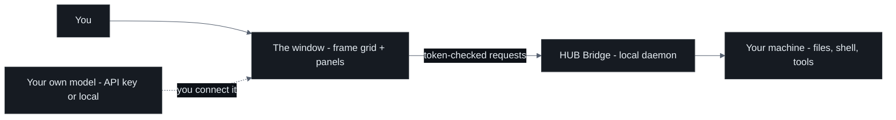
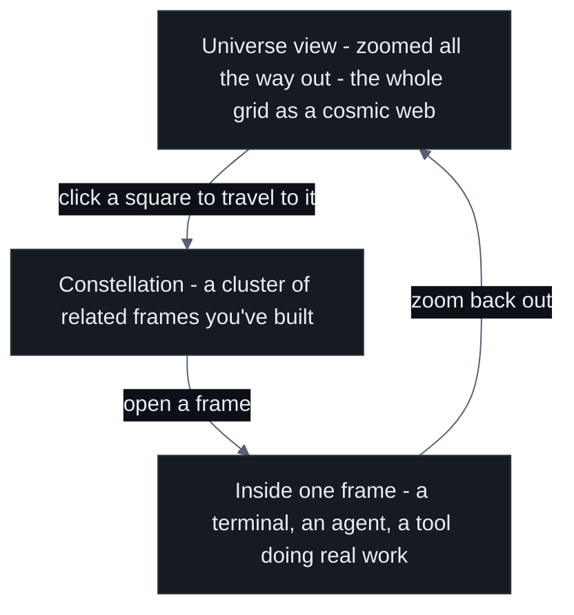
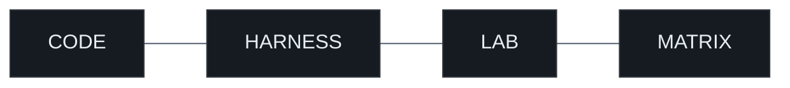
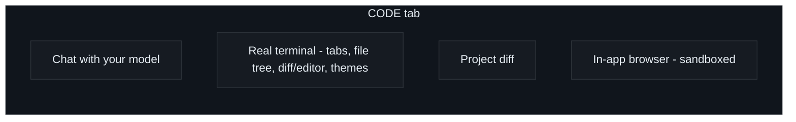
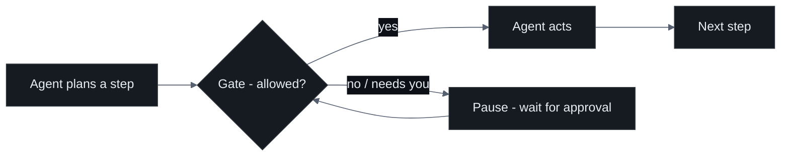
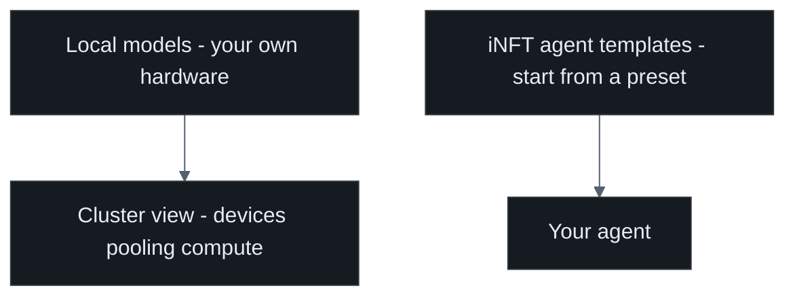
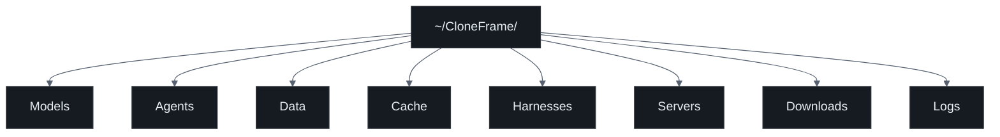
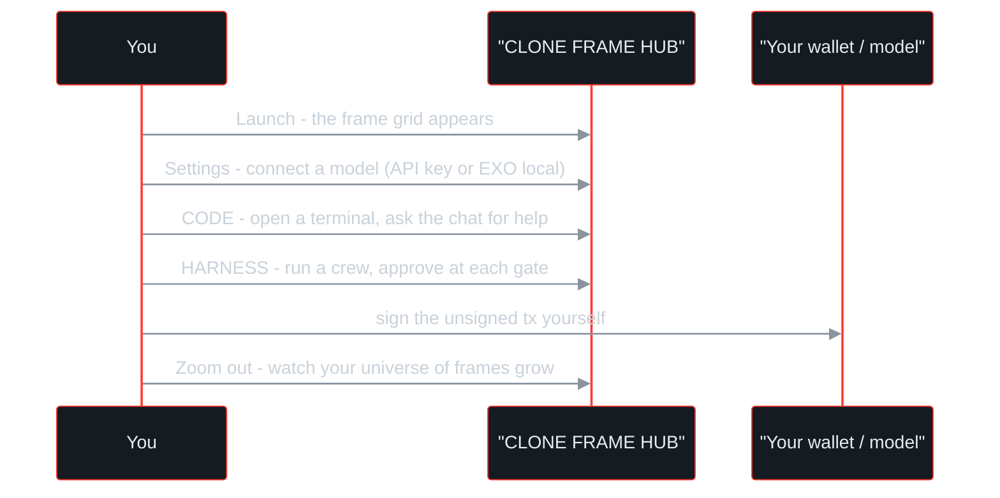

# How It Works — A Guided Tour of CLONE FRAME · HUB

> **A visual interface between you and your machine — a Unix with a face.**

This page walks you through the app the way you'd actually use it: open it, look around,
and go tab by tab. Each section follows the same simple pattern — **what it is**, then
**how to use it** — with a small diagram wherever a picture helps more than words.

> ⚠️ **Status: PREVIEW / PRODUCTION.** This is a powerful, working app — and it is *not*
> yet ready for unattended, hands-off production use. Keep an eye on what agents do,
> especially the first few times you turn a permission on. Nothing dangerous is on by
> default; you decide what to enable.

---

## Before we start: the two-piece mental model

CLONE FRAME · HUB is only two things working together.

| Piece | What it is | Where it runs |
|---|---|---|
| **The window** (`index.html`) | The whole visual interface — the frame grid and every panel | Your browser / the double-click app |
| **The HUB Bridge** | A small local Node daemon that actually does things on your machine | `127.0.0.1:8765`, paired to your window by a one-time token |

Two things worth knowing up front:

- **There is no built-in AI.** You bring your own model — either an API key that never
  leaves your machine, or a fully local model you run yourself (via **MATRIX**, covered
  below). The app is the cockpit; the engine is yours.
- **The window never touches a tool directly.** Everything goes through the Bridge, which
  checks a token and the request's origin on every single call. You don't have to think
  about this to use the app — but it's why the app can be both powerful and safe.

---

## The frame grid & "The Universe in Frames"

**What it is.** The home screen is a grid of squares — *frames*. Each frame is a small
piece of your workstation: a terminal, an agent, a folder, a tool. The big idea is that
when you zoom all the way out, the grid stops looking like an app and starts looking like
a cosmos: every square is a frame, and every empty square is a frame *waiting to be built*.
That's the cover concept — **the universe in frames**.

**How to use it.** Think in three zoom levels.

- **Zoom out** to see the whole universe — the shape of everything you've built.
- **Click a square** to travel to it. Empty square? That's an invitation: build something there.
- **Zoom in** on any frame to work inside it.

You never lose your place: the grid is the map, and the top-bar tabs (next) are the fast
routes to the big rooms.

---

## The top bar: four rooms

Across the top you'll find five main tabs. Everything else (Email, Automations, Folders,
Settings) lives one click away in the menu.

Let's walk through each.

---

## CODE — chat, terminal, diff, browser

**What it is.** Your day-to-day workshop. CODE bundles four things you'd normally juggle
across separate apps: a chat with your model, a *real* terminal, a project diff, and an
in-app browser.

**How to use it.**

- **Chat** — talk to the model you connected. Ask it to explain code, draft a file, plan
  a change. It's a conversation, not a black box.
- **The terminal** — this is a genuine, interactive terminal, not a fake one. It supports:
  - **Multiple tabs** (run several shells side by side)
  - A **file tree** to browse your project
  - A **diff / editor** view to read and change files
  - **zsh themes** and **tab-autocomplete**, so it feels like your own shell
- **Project diff** — see exactly what changed across your files before you commit to anything.
- **In-app browser** — open docs, dashboards, or your own running site *inside* the app,
  with real JavaScript, video and WebGL. The page actually runs in a **separate Chrome
  process** that the Bridge drives over a debugging pipe; what you see in the panel is
  its picture, painted onto a canvas. Nothing of the page runs inside CLONE FRAME, so a
  web page has no way to reach your token or the Bridge.

> The terminal is powered by the **Live Terminal** — real keystrokes flow over a single
> secure channel to a real shell on your machine. Same engine drives the TMUX "▸ Live"
> view later on.

---

## HARNESS — agent crews with safety gates

**What it is.** A place to run *crews* of agents on a task — but with brakes. A **harness**
is a plan-then-act workflow where agents propose steps and **gates** decide whether those
steps are allowed to proceed.

**Why a gate matters.** A gate is a checkpoint that cannot be quietly skipped. The agent
must stop, and the run only continues when the gate's condition is met (for example, your
approval, or a check passing). It's the difference between "the agent did a thing and told
you after" and "the agent asked before doing the thing." These gates are *non-collapsible* —
an agent can't merge them away to move faster.

**How to use it.** Describe the job, pick your crew, and let it plan. When a gate lights up,
review what the agent wants to do and approve (or don't). You stay in the loop at exactly
the moments that matter, and nowhere else.

---

## LAB — local models, the cluster, iNFT templates

**What it is.** The engine room for *models* rather than tasks. LAB is where you point the
app at the brains it will use and see the hardware behind them.

**How to use it.**

- **Local models** — register and manage models running on your own hardware, so you can
  work with zero cloud dependency.
- **The cluster** — a view of the machines (yours) pooling their compute. When you run a
  local model across several devices, this is where you see it come together.
- **iNFT agents** — ready-made **agent templates**. Start from a template instead of a blank
  page, then shape it into the agent you want.

---

## What used to be here — CLI ECONOMY OS and INTEGRATIONS

This tour described two more rooms at this point: **CLI ECONOMY OS**, an on-chain agent
economy, and **INTEGRATIONS**, an in-app installer for EXO LAB, Manaflow and TMUX. Neither
is in the app. Both were removed, and the sections that walked you through them were
walking you through a screen that no longer exists.

What replaced them, and is real:

- **Wallet sign-in** lives in the header (top right) and in **MY AGENTS** → *Connect wallet*.
  The app reads your wallet and can build transactions; it never signs one — you do, in your
  own wallet. See [CONNECT.md §5](CONNECT.md).
- **MATRIX**, the fourth room in the top bar, is the local AI cluster: your own devices,
  serving your own models, with no cloud key involved.

The tools that INTEGRATIONS would have installed are not bundled in this build and have no
in-app installer. iT already covers what TMUX was for — workspaces, splits and sessions that
survive a disconnect.

## The rest: Email, Automations, Folders, Settings

These aren't top-bar tabs, but they're part of everyday use.

### Email — bring your own mailbox
**What it is.** An email client that uses *your* provider. **How to use it.** Add your SMTP
and IMAP details in Settings. Nothing is routed through a third party — the app talks to your
mail server directly, and autonomous sending stays **off** until you switch it on.

### Automations — scheduled tasks
**What it is.** Jobs that run on a schedule. **How to use it.** Define a task, set when it
should run, and let it fire on its own — a report every morning, a cleanup every night.

### Folders — the `~/CloneFrame/` file system
**What it is.** On first run the app creates a plain, visible folder in your home directory —
`~/CloneFrame/` — with a clear sub-folder for each kind of thing. **How to use it.** Treat it
like any folder; it shows up in Finder, and every part of the app reads and writes here.

Nothing is hidden in a database you can't see. If you want to know what the app is doing,
open the folder and look.

### Settings & permissions — you hold the switches
**What it is.** The control panel for the whole app — and the single most important habit to
learn. **Every powerful capability is OFF by default.** Shell access, file-writing, web access,
and email autonomy are opt-in switches you turn on deliberately.

```mermaid
%%{init: {'theme':'base','themeVariables':{'background':'#0d1117','mainBkg':'#161b22','primaryColor':'#161b22','primaryBorderColor':'#ff3b30','primaryTextColor':'#e6edf3','nodeBorder':'#30363d','nodeTextColor':'#e6edf3','lineColor':'#566070','secondaryColor':'#161b22','tertiaryColor':'#0d1117','clusterBkg':'#10151c','clusterBorder':'#30363d','titleColor':'#e6edf3','edgeLabelBackground':'#0d1117','fontFamily':'ui-monospace, SFMono-Regular, Menlo, monospace','actorBkg':'#161b22','actorBorder':'#ff3b30','actorTextColor':'#e6edf3','signalColor':'#8b949e','signalTextColor':'#c9d1d9','labelBoxBkgColor':'#161b22','labelBoxBorderColor':'#30363d','labelTextColor':'#e6edf3','loopTextColor':'#e6edf3','noteBkgColor':'#1c2028','noteBorderColor':'#e8b86d','noteTextColor':'#c9d1d9','activationBkgColor':'#30363d','activationBorderColor':'#8b949e','sequenceNumberColor':'#0d1117'}}}%%
flowchart LR
  Default["Fresh install - everything powerful OFF"] --> Choose["You flip a switch in Settings"]
  Choose --> On["That one capability is now allowed"]
  On --> Safe["Catastrophic commands stay blocked - even in root mode"]
```

A few guarantees worth remembering:

- **Loopback only.** The Bridge listens on `127.0.0.1` — it isn't reachable from the network.
- **Catastrophic commands are blocked** (things like wiping a disk) *even* when you've enabled
  full shell access.
- **Your secrets stay yours.** API keys and credentials live in your own session/`.env` and
  are never written into the app, its logs, or the repository.

---

## Putting it together: a first session

Start small: connect a model, open a terminal in **CODE**, and build your first frame. Then
zoom out and watch the universe fill in, one square at a time.

---

**⭐ Support the developer — star this repo**