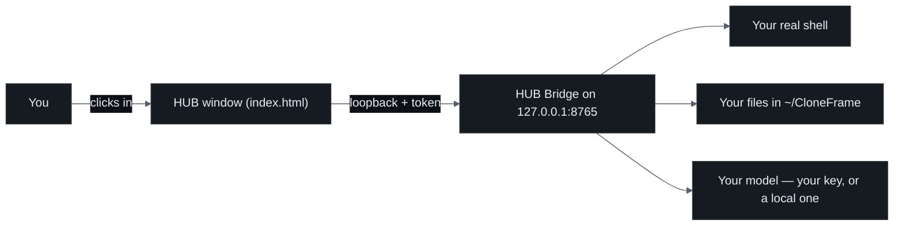
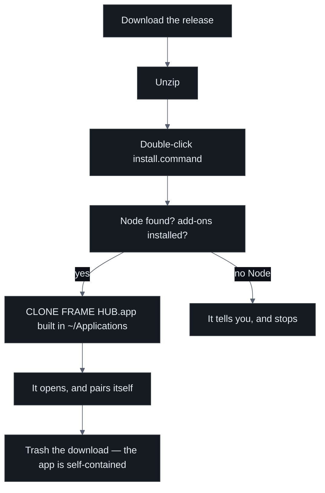
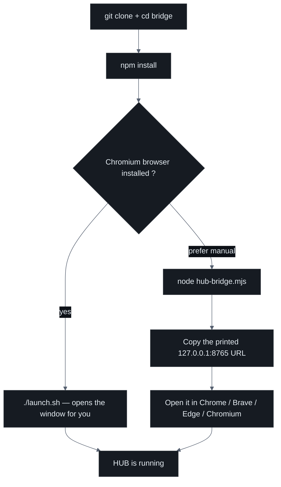
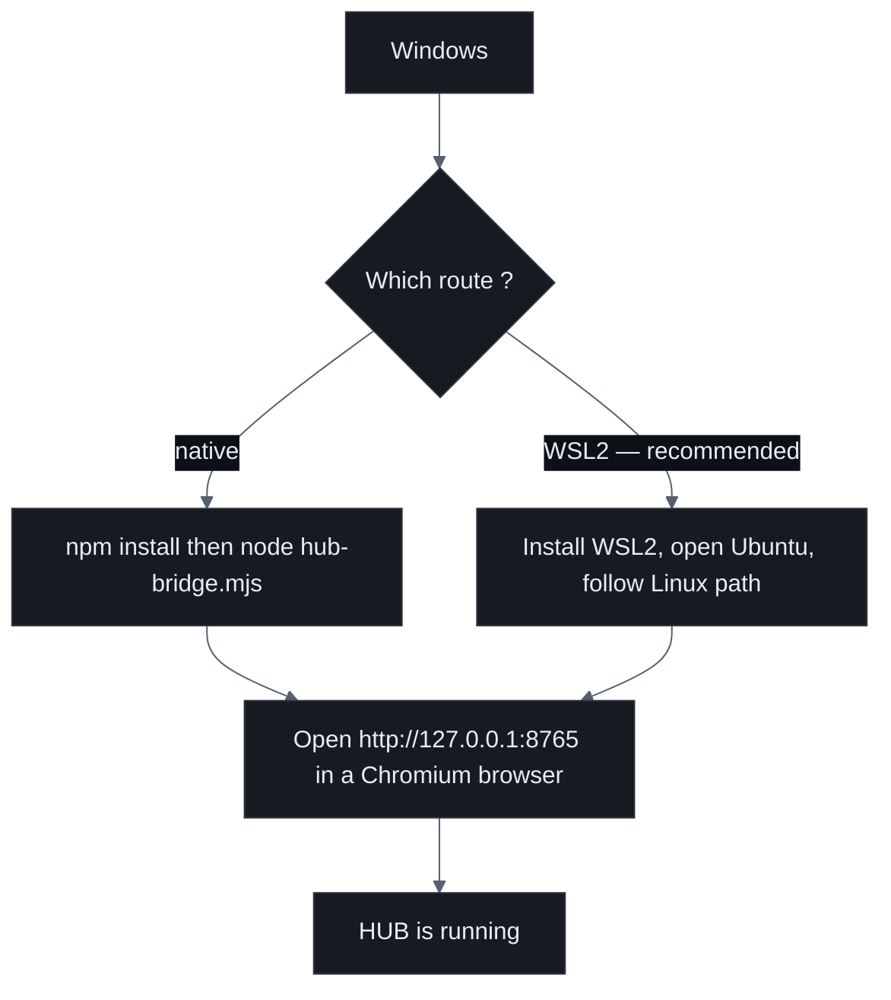
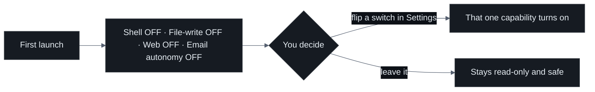

# Install CLONE FRAME · HUB

**A visual interface between you and your machine — a Unix with a face.**

This guide takes you from a fresh computer to a running HUB window, step by step.
It assumes you are smart but have barely touched a terminal before. Every command
is spelled out; nothing is left to guess.

---

> ### ⚠️ Status: Production / Preview
>
> CLONE FRAME HUB is **powerful but not yet ready for unattended production use.**
> It runs entirely on your own machine and every dangerous permission starts
> **switched off**, but you should treat it as a preview: watch what it does,
> keep backups, and do not point it at anything you cannot afford to lose. You are
> the pilot — the app never runs the risky controls unless you flip the switch.

---

## What you are installing

Two small pieces, nothing else:

| Piece | What it is | Where it runs |
|---|---|---|
| `index.html` | The **entire** app — the frame grid and every panel, in one file | A Chromium browser window on your machine |
| The **HUB Bridge** | A tiny local server (`bridge/hub-bridge.mjs`) that gives the window a real terminal, your model, email, and files | `127.0.0.1:8765` — your machine only, never the internet |

The Bridge is written in plain Node. Its core needs **no libraries at all** — only
Node's built-ins. `npm install` pulls in a small handful of **optional** add-ons:
three for email, plus two (`node-pty` and `ws`) that power the live terminal. If a
download ever fails, the app still starts; the affected feature simply stays quiet.



---

## Step 0 — Prerequisites

You need three things. The table gives the exact install command for each system.
Do this once; then never again.

| Tool | Why | macOS | Linux (Debian/Ubuntu) | Linux (Fedora) | Windows |
|---|---|---|---|---|---|
| **Node.js ≥ 18** | Runs the Bridge | `brew install node` | `sudo apt install nodejs npm` | `sudo dnf install nodejs` | `winget install OpenJS.NodeJS.LTS` |
| **git** | One way to get the app — on macOS you can just download the release zip instead | `brew install git` | `sudo apt install git` | `sudo dnf install git` | `winget install Git.Git` |
| **A Chromium browser** | Draws the app window | `brew install --cask google-chrome` | `sudo apt install chromium-browser` | `sudo dnf install chromium` | `winget install Google.Chrome` |

Any Chromium-family browser works: **Google Chrome, Brave, Microsoft Edge, or
Chrome for Testing.** Safari and Firefox are not supported for the app window.

> **On macOS, `brew` is Homebrew.** If you do not have it, paste the one-line
> installer from [brew.sh](https://brew.sh) into your Terminal first, then come back.

**Check your Node version** — you want 18 or higher:

```bash
node --version
```

If that prints something like `v20.11.0`, you are ready. If it says
"command not found", install Node from the table above and try again.

> **Windows tip:** if `winget` is not available, install Node with **nvm-windows**
> (from the `coreybutler/nvm-windows` releases page): download the installer, then
> run `nvm install lts` and `nvm use lts` in a new terminal.

---

## macOS — the primary, best-supported path

This is the path we build and test on first. There are no commands to memorise.

### Two steps

1. **Download** the
   [latest release](https://github.com/devclone20/cloneframe_app_executable/releases/latest)
   and unzip it.
2. **Double-click `install.command`.**

That is the whole install. It checks Node, installs the daemon's five small add-ons,
builds **`CLONE FRAME HUB.app`** into your `~/Applications` folder with the entire
program inside the bundle, and opens it. The window **pairs itself automatically** —
there is no token to copy.

> **If macOS refuses to open it**, that is Gatekeeper, not a broken file: anything
> downloaded from the web is quarantined until you say otherwise. Right-click the file →
> **Open** → **Open** once, and it never asks again. Or run it from Terminal, which
> never asks at all:
>
> ```bash
> cd ~/Downloads/cloneframe_app_executable && zsh install.command
> ```

Once it finishes, **the folder you downloaded can go in the Trash.** The app carries
everything it needs: `index.html`, the daemon, and its dependencies all live inside
`CLONE FRAME HUB.app`.

### The picture



### Updating, and removing

**To update:** drag the old `CLONE FRAME HUB.app` to the Trash, download the new
release, run its `install.command`. Your data is never inside the app — it lives in
`~/CloneFrame` and `~/.clone-frame-hub` — so an update leaves every setting, session
and folder exactly as it was.

**To remove:** Trash the app, or run **`uninstall.command`**, which stops the daemon,
removes the app, and asks separately whether to delete your data. It will not decide
that for you.

### The manual path

If you would rather do it by hand, or you want the daemon running from a folder you
control rather than from inside a bundle:

```bash
cd bridge
npm install            # a few small add-ons; the core is pure Node built-ins
./launch.sh            # starts the Bridge and opens the app window
```

`launch.sh` starts the Bridge on `127.0.0.1`, waits for it to become healthy, then
opens the HUB in its own Chromium app window. To build the double-click app from that
same folder — as a shortcut into it rather than a self-contained copy — run
`zsh bridge/make-app.sh` (add `--bundle` for the self-contained one, which is what the
installer does).

> To place the app somewhere else, pass a folder: `zsh bridge/make-app.sh ~/Desktop`.

```mermaid
%%{init: {'theme':'base','themeVariables':{'background':'#0d1117','mainBkg':'#161b22','primaryColor':'#161b22','primaryBorderColor':'#ff3b30','primaryTextColor':'#e6edf3','nodeBorder':'#30363d','nodeTextColor':'#e6edf3','lineColor':'#566070','secondaryColor':'#161b22','tertiaryColor':'#0d1117','clusterBkg':'#10151c','clusterBorder':'#30363d','titleColor':'#e6edf3','edgeLabelBackground':'#0d1117','fontFamily':'ui-monospace, SFMono-Regular, Menlo, monospace','actorBkg':'#161b22','actorBorder':'#ff3b30','actorTextColor':'#e6edf3','signalColor':'#8b949e','signalTextColor':'#c9d1d9','labelBoxBkgColor':'#161b22','labelBoxBorderColor':'#30363d','labelTextColor':'#e6edf3','loopTextColor':'#e6edf3','noteBkgColor':'#1c2028','noteBorderColor':'#e8b86d','noteTextColor':'#c9d1d9','activationBkgColor':'#30363d','activationBorderColor':'#8b949e','sequenceNumberColor':'#0d1117'}}}%%
flowchart LR
  M["./make-app.sh"] --> N["CLONE FRAME HUB.app in ~/Applications"]
  N --> O["Double-click from Finder or Dock"]
  O --> P["Bridge starts + window opens"]
```



---

## Linux

`install.command` is macOS-only — it builds an AppleScript `.app` bundle, which does
not exist here. Everything underneath it does: **clone, install the daemon's add-ons,
run it, and open the app in a browser window.**

### Install and run

```bash
git clone https://github.com/devclone20/cloneframe_app_executable.git
cd cloneframe_app_executable/bridge
npm install
```

`launch.sh` assumes a **Chromium browser is present** on the machine (it looks for
Chrome, Brave, Edge, or Chromium). If you have one, you can try:

```bash
./launch.sh
```

If the launcher cannot find a browser, or you would rather do it by hand, run the
Bridge directly and open the URL yourself:

```bash
node hub-bridge.mjs
```

The Bridge prints a banner. Look for the line that says **`app`** and open that
address in your Chromium browser:

```
  app        http://127.0.0.1:8765   ← open this (auto-pairs)
```

Opened from that same address, the window **pairs itself automatically.**



> **Note:** the `.app` bundler and the Finder pop-ups are macOS-only helpers.
> Everything that matters — the Bridge, the terminal, the browser, email, folders —
> works the same on Linux inside a browser window.

---

## Windows — experimental

> ### 🧪 Windows is EXPERIMENTAL
>
> The Bridge is plain Node and runs cross-platform, so the app itself works. But
> the `launch.sh` / `make-app.sh` helpers are macOS/Linux shell scripts — they do
> **not** run on Windows. You start the Bridge by hand and open the URL yourself.
> For the smoothest experience, use **WSL2** and follow the Linux path instead.

### Route A — WSL2 (recommended)

WSL2 gives you a real Linux inside Windows. Once it is set up, the whole Linux
section above applies unchanged.

1. Open **PowerShell as Administrator** and run `wsl --install`, then restart.
2. Open the **Ubuntu** app that appears in your Start menu.
3. Inside it, follow the **Linux** steps above (`apt install nodejs npm git`, then
   clone, `npm install`, and `node hub-bridge.mjs`).
4. Open the printed `http://127.0.0.1:8765` in your Windows Chromium browser.

### Route B — native Windows (plain Node)

If you prefer not to use WSL2:

```powershell
git clone https://github.com/devclone20/cloneframe_app_executable.git
cd cloneframe_app_executable\bridge
npm install
node hub-bridge.mjs
```

Then open **`http://127.0.0.1:8765`** in Chrome, Brave, or Edge. The window pairs
itself from that address.



> **If `npm install` complains on native Windows**, it is usually the live-terminal
> add-on (`node-pty`) trying to build. Two honest options: install the Node build
> tools (`npm install --global windows-build-tools` in an Administrator terminal),
> or simply use **WSL2**, where it just works. Even if that one add-on fails, the
> rest of the app still starts — you just lose the in-window live terminal.

---

## First run — what happens the first time

### 1. Your folder appears: `~/CloneFrame/`

The moment the Bridge starts, it creates a plain folder in your home directory
called **`CloneFrame`**. Open it in Finder or your file manager — it is not hidden,
it is not magic. Every part of the app reads and writes here, so your data stays
yours, in files you can see.

| Folder | Holds |
|---|---|
| `Models` | Local and remote model pointers |
| `Agents` | One folder per agent / iNFT |
| `Data` | Working data |
| `Cache` | Safe-to-clear caches |
| `Harnesses` | Your agent-crew definitions |
| `Servers` | Non-secret pointers to online servers |
| `Downloads` | Things the app downloads |
| `Logs` | Logs |

> **Secrets never live here.** API keys and the pairing token live in a separate
> private folder, `~/.clone-frame-hub/`, and are never written into `CloneFrame`,
> the app, or the repository.

### 2. The pairing token

The Bridge protects itself with a **pairing token** — a random secret generated
each time it starts. When you open the app from the URL the Bridge itself serves
(`http://127.0.0.1:8765`), the token is handed to the window **automatically**;
you never see or type it. Together with the loopback-only binding, this means only
a window on *your* machine, opened the right way, can talk to the Bridge.

If you run the app from a different address (for example a separate dev preview),
the banner also prints a one-line pairing snippet you can paste into
**MY MACHINE → HUB BRIDGE**. The token file itself lives at
`~/.clone-frame-hub/bridge.token` with `chmod 600` (owner-only).

### 3. All permissions start OFF

This is the heart of the safety model. Out of the box the app can *show* you
things but cannot *do* powerful things. Shell execution, file-writing, web access,
and email autonomy are **opt-in switches in Settings** — every one starts off.



Even with everything switched on and running as root, **catastrophic commands**
(`rm -rf /`, `mkfs`, `dd` to a disk) are blocked. And your wallet, if you connect
one, is the sole key holder — the app only ever builds **unsigned** transactions.
It never asks for a private key or seed phrase.

---

## Troubleshooting

| Symptom | What it means | What to do |
|---|---|---|
| **`address already in use` / port 8765 busy** | Another program (or an old Bridge) holds the port | Start on another port: `HUB_BRIDGE_PORT=8790 node hub-bridge.mjs`, then open `http://127.0.0.1:8790`. Or close the old process and retry. |
| **`node: command not found`** | Node is not installed or not on your PATH | Install Node from the prerequisites table, open a **new** terminal, run `node --version`. |
| **Browser window never opens (macOS/Linux)** | `launch.sh` could not find a Chromium browser | Install Chrome/Brave/Edge, or run the Bridge by hand (`node hub-bridge.mjs`) and open the printed URL yourself. |
| **Nothing happens after double-clicking the .app** | The launcher hit an early error | Read `~/.clone-frame-hub/launch.log` — it records each launch and why it stopped. |
| **Window opens but says "not paired"** | You opened a different origin than the Bridge serves | Open the exact `http://127.0.0.1:8765` from the banner, or paste the printed pairing snippet into **MY MACHINE → HUB BRIDGE**. |
| **`npm install` fails on the terminal add-on** | `node-pty` needs build tools (common on Windows) | Install build tools, or use **WSL2**. The app still runs without it; you only lose the in-window live terminal. |
| **The app asks to turn a permission on** | You tried an action that needs an opt-in switch | That is by design. Open **Settings**, read what the switch enables, and flip it only if you want that power. |
| **A model call does nothing** | No model connected | In Settings, add your own API key — the app ships no model of its own. (Local models via MATRIX are coming soon.) |
| **Bridge started but a feature is silent** | An optional add-on did not install | Check `~/.clone-frame-hub/server.log`. The core keeps running; re-run `npm install` to restore the add-on. |

---

## Where things live (quick reference)

| Path | What it is |
|---|---|
| `~/CloneFrame/` | Your visible data folders |
| `~/.clone-frame-hub/` | Private config, logs, and the pairing token |
| `~/.clone-frame-hub/launch.log` | Every launch attempt (macOS launcher) |
| `~/.clone-frame-hub/server.log` | The Bridge's own output |
| `~/.clone-frame-hub/bridge.token` | The pairing secret, owner-only |
| `127.0.0.1:8765` | Where the Bridge listens — your machine only |

---

You are done. Open the window, add your model in **Settings**, and start building
frames.

**⭐ Support the developer — [star this repo](https://github.com/devclone20/cloneframe_app_executable).**